<div align="center">


# Trellora

**A local-first AI knowledge workspace for Windows**

Where ideas grow connected.

Markdown notes, source documents, AI conversations, and connected knowledge in one desktop workspace.

[简体中文](README.md) · **English**

[](#quick-start)
[](#data-and-privacy)
[](#architecture)

[Download](#download) · [Features](#features) · [Menus and screenshots](#menus-and-screenshots) · [Quick start](#quick-start) · [Detailed architecture](docs/architecture.en.md) · [Report an issue](https://github.com/Elevenoven/Trellora-plus/issues)

</div>

## What is Trellora?

Trellora is for developers, students, and knowledge workers who regularly read, write, and organize information. Write notes as ordinary Markdown files, import project documents, find supporting evidence with search and AI, and save useful results as notes, chapter knowledge, or traceable memories.

The workflow is **collect → parse and index → read and ask → save as notes → connect → reuse**. Note libraries support writing; materials libraries preserve and retrieve sources; Wiki supports chapter-based learning; Map reveals relationships across documents; the assistant connects these workflows.

The current target is **Windows x64**, and development is ongoing. This README describes the current working tree. Model, embedding, web search, and PDF cloud parsing requirements are stated where relevant. See the [desktop distribution acceptance record](docs/verification/desktop-distribution-acceptance.md) for release validation status.

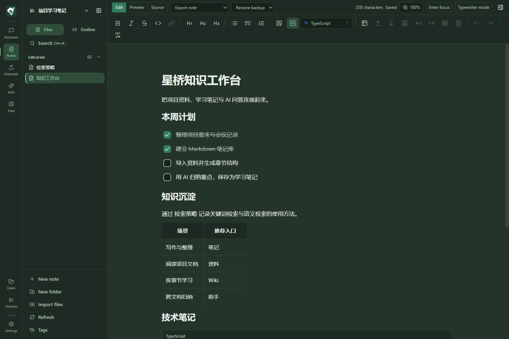

## Contents

- [Download](#download)
- [Features](#features)
- [Menus and screenshots](#menus-and-screenshots)
- [Suggested workflow](#suggested-workflow)
- [Quick start](#quick-start)
- [Models and external services](#models-and-external-services)
- [Architecture](#architecture)
- [Data and privacy](#data-and-privacy)
- [Development and validation](#development-and-validation)
- [Documentation and participation](#documentation-and-participation)

## Features

| Capability | What you can do |
| --- | --- |
| Markdown writing | Rich text, preview, and source modes; tables, tasks, code, math, Mermaid, and Wiki links; live character count, zoom, focus, and typewriter modes |
| Local files and multiple libraries | Create and register note libraries, browse trees, import notes, and manage folders; open standalone text files without creating a library |
| Search and connections | Local keyword, semantic, and combined retrieval; tags, backlinks, related content, and document entity graphs |
| Document pipeline | Local text and DOCX parsing; authorized MinerU PDF parsing; logical lines, structure trees, parent/child chunks, keywords, vectors, and optional graph enrichment |
| AI conversations and writing | Open chat, current-note, and knowledge-base scopes; streaming, cancellation, tool activity, source citations, attachments, and saving answers as notes |
| Wiki learning workspace | Chapter tree and canvas, source reading, node analysis, full Wiki generation, chapter retries, derived nodes, and organized learning results |
| Memory and personalization | Conversation history and search, long-term memory, original conversation links, manual and explicit saves, optional extraction, and reviewable changes |
| Desktop experience and recovery | Chinese/English UI, light/dark themes, five palettes, onboarding, note backups, full workspace backup/restore, relocation, and diagnostics |

Editing, file browsing, and note keyword search work without AI configuration. Vector retrieval needs an embedding model; AI answers and generation need a usable model; Map needs graph enrichment enabled and completed in the materials pipeline.

## Menus and screenshots

The main rail contains **Assistant, Notes, Materials, Wiki, and Map**. **Open, Libraries, and Settings** are available at the bottom. Screenshots include an Electron demo running the current source and actual-use screens supplied by the user. English and Chinese screens and different themes are included; document text remains in its original language. See [showcase assets](docs/assets/README.md) for provenance.

### Assistant

Ask questions, analyze documents, and turn answers into notes. The workspace includes conversations, question navigation, the composer, attachments, scope, answer depth, thinking mode, and model selection. The history entry lets you find and resume earlier sessions.

| Scope | Content available | Typical tasks |
| --- | --- | --- |
| Open chat | Your question, selected attachments, and applicable conversation context | General questions, writing, explanations, and analysis |
| Current note | The selected note and chapters read as needed | Summarizing, explaining, reviewing, and follow-up questions |
| Personal knowledge base | Retrieved evidence from the selected materials library | Cross-document synthesis, project evidence, and study materials |

Answers stream and can be stopped. Document citations locate sources, while complex tasks can show plans and tool activity. Optional web search adds public information. You can edit an answer before saving it into a chosen note library. Long-term memory references are displayed separately from document evidence, with their own source links.

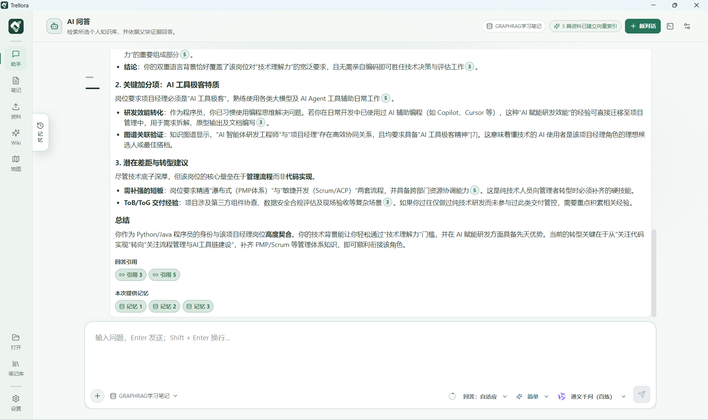

<details>
<summary>English interface with the dark theme</summary>

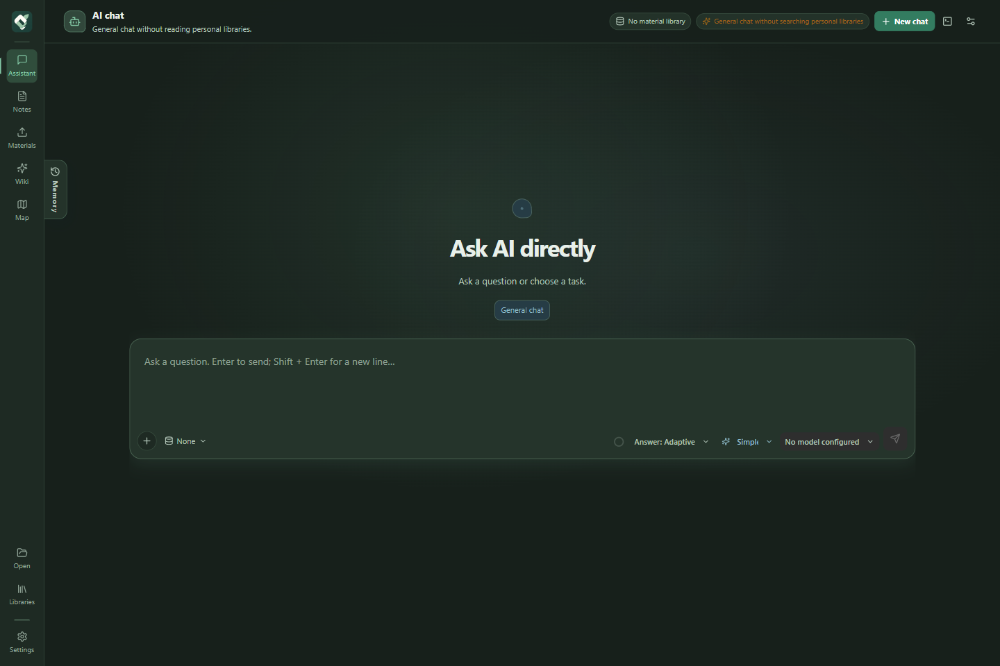

</details>

### Notes

Write and manage Markdown notes. The left panel contains the library selector, file tree, outline, search, tags, note/folder creation, import, and refresh. The editor occupies the center; note information and current-note AI are available on the right.

- **Edit / Preview / Source:** Tiptap rich text, rendered Markdown, and CodeMirror source editing.
- **Document content:** Headings, lists, tasks, quotes, links, images, tables, highlighted code, KaTeX math, Mermaid, and Wiki links.
- **Writing tools:** Live character count, zoom, outline navigation, selection toolbar, AI selection transformations and expansion, focus mode, and typewriter mode.
- **Note information:** File metadata, tags, overview, and suggestions; AI-generated sections require a model.
- **Save and export:** Library autosave, save status, backup recovery, and export options including HTML.

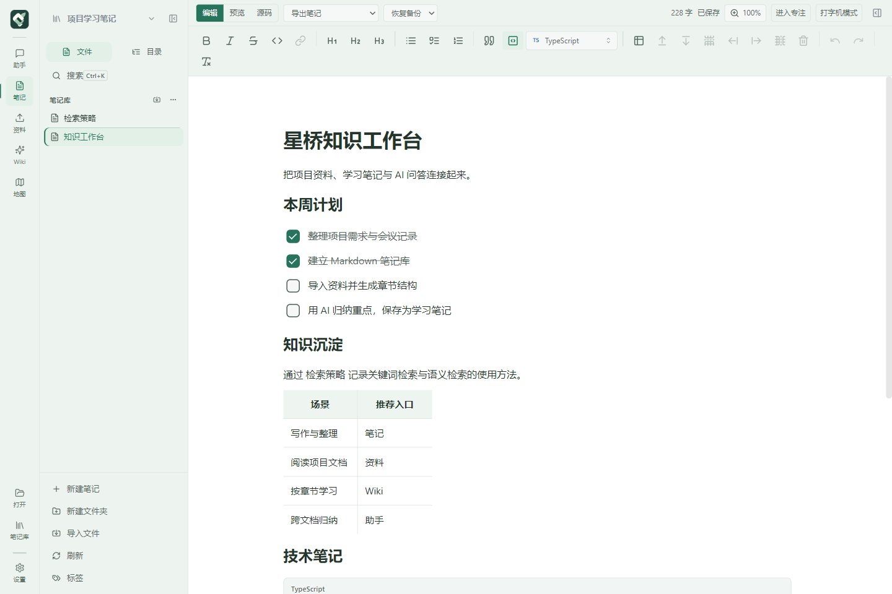

While reading or editing, use the right-hand panel to ask about the current note or select preset tasks for summaries, overviews, learning paths, and organization suggestions.

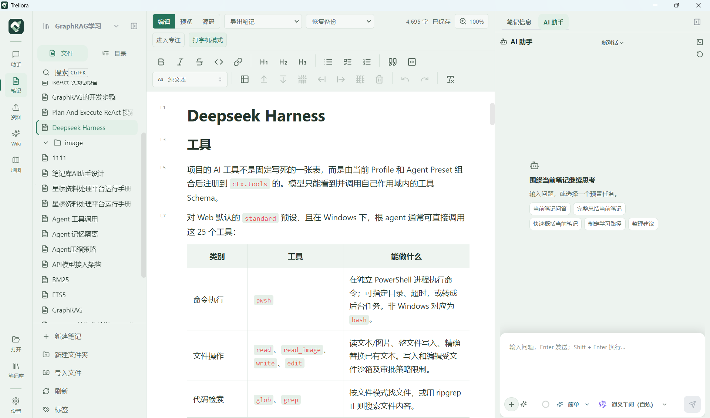

### Materials

Manage source documents used by the knowledge base. The page includes libraries, document lists, search and sorting, upload, rescan, rename, delete, previews, and pipeline configuration, status, and artifacts.

Text files are parsed locally, and DOCX uses a local Mammoth Worker Thread. PDFs can be imported and previewed first; the current searchable parsing route uses MinerU, which requires configuration and separate permission to upload the document.

Configured stages cover parsing, logical lines, structural signals, ambiguity handling, structure trees, parent/child chunks, keywords, vectors, and entities. The UI shows actual state, progress, errors, cancellation, and retries. Artifacts stay under `.menghan-meta/`; processing does not overwrite the source document. Graph enrichment and LLM-assisted stages are optional.

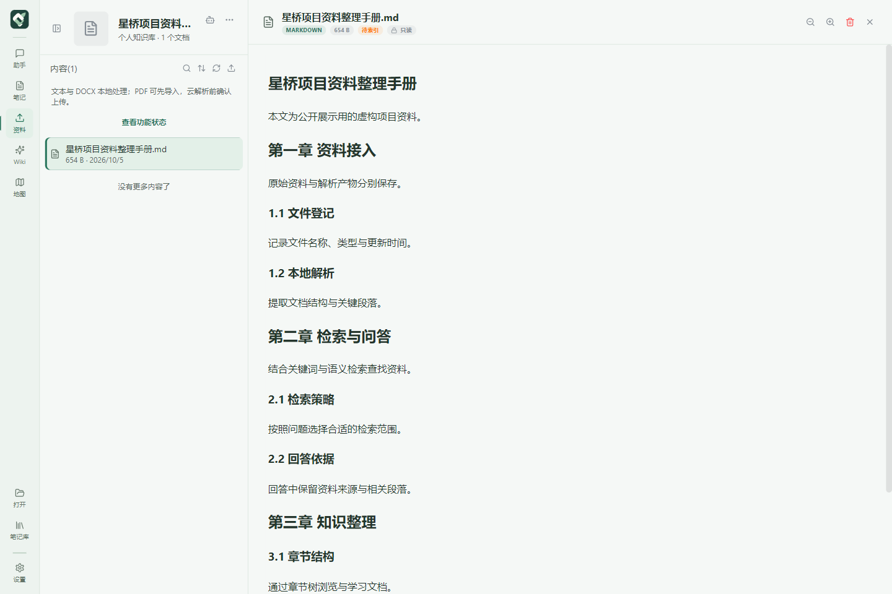

### Wiki

Turn structurally indexed materials into a chapter-based learning workspace. Select a library and document to display the outline and the parent/child node canvas. Search nodes, collapse chapters, zoom, fit the view, and reorder sibling chapters.

Wiki supports node analysis and full generation, with guided and automatic modes. Read source content, ask chapter-specific questions, run quick analyses, and retain results as derived nodes or Wiki AI content. Chapter tasks support cancellation and failure retries. Documents can also be imported into a note library for further editing.

**Browsing the structure uses local pipeline results; AI analysis and generation require a model.** Wiki's chapter tree and Map's cross-document entity graph serve different navigation needs.

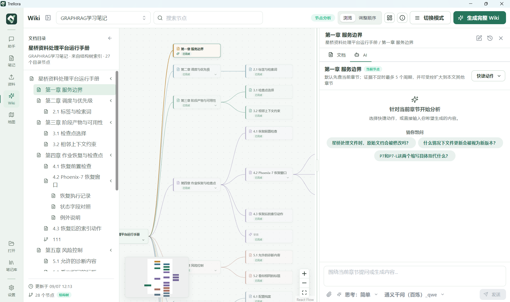

### Map

Explore entities, relationships, and communities in a materials library. Controls include the library selector, community/entity views, entity search, document filters, details, and fit-to-view. Click, drag, or expand communities to explore connections.

Enable graph enrichment in the materials pipeline and complete entity processing and library graph assembly before a graph appears. The graph also supports local entity retrieval and global community retrieval for the assistant. Community summaries explain broader themes; answer evidence still needs to trace back to source documents.

This screenshot shows the **actual state before graph enrichment has produced a projection**, including the required next steps.

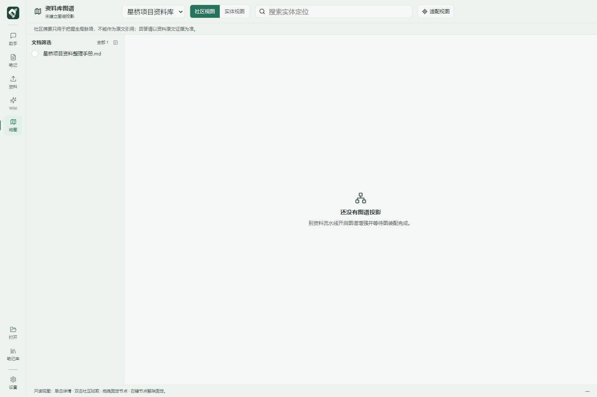

### Open

Open MD, Markdown, TXT, and other supported text files directly with `Ctrl+O`. The menu also provides recent files, standalone draft recovery, and pending open requests.

The standalone workspace shows the path, encoding, line endings, save status, and character count. It supports Edit / Preview / Source, Save, Save As, and adding the document to a library. Standalone Markdown includes controlled local-image access, image pasting, and document AI. **Edits are saved as recovery drafts; the original file is written when you explicitly save**, separately from library autosave.

Windows launch arguments and drag-and-drop share an open queue. The installer offers optional Open With registration for `.md`, `.markdown`, and `.txt`.

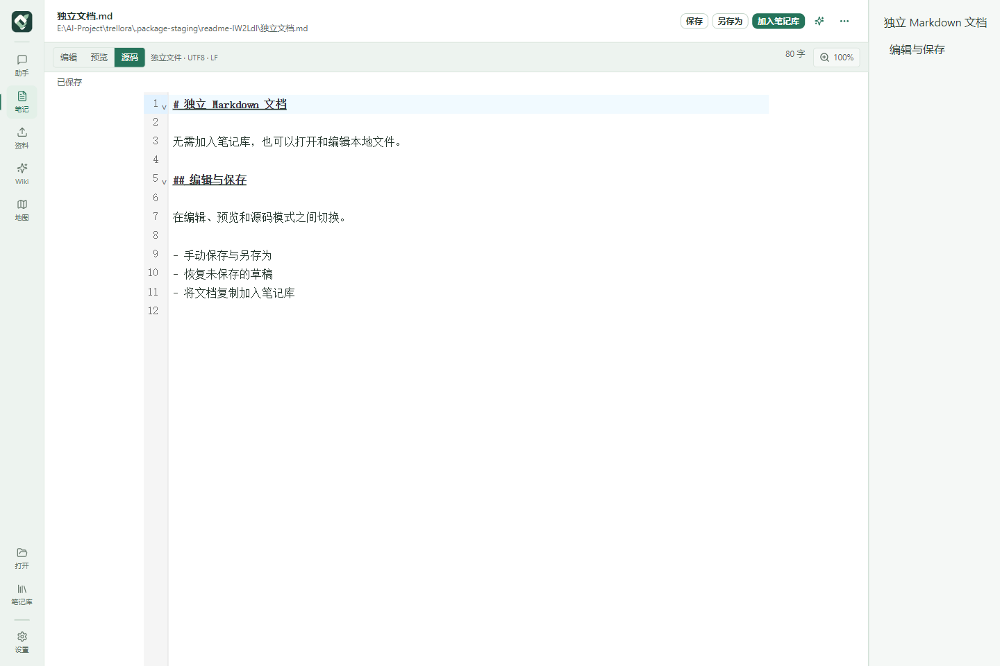

### Libraries

Manage registered note libraries. The page shows names, disk locations, note counts, last-opened times, and availability, with name/path search and pagination.

Create libraries, enter registered libraries, copy their locations, remove registrations, or use library actions to upgrade a library to a materials library. **Removing a registration retains the files on disk.** This menu remains available when the file sidebar is collapsed.

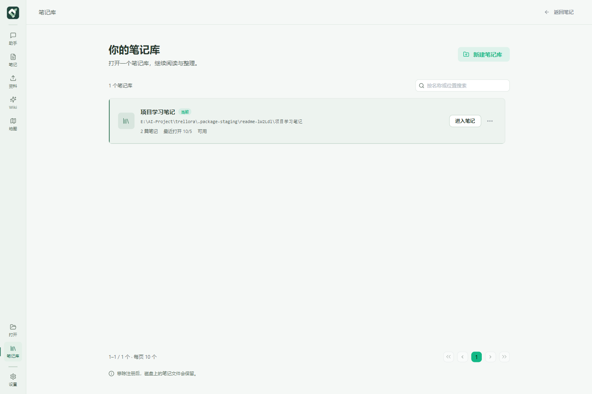

### Settings

Settings has ten sections organized under Workspace, Documents, AI settings, and System:

| Section | Content |
| --- | --- |
| General | Onboarding; system/light/dark appearance; five palettes; comfortable/compact density; Chinese/English; startup behavior and web-link handling |
| Workspace & backups | Workspace path, open folder, relocation, switching workspaces, complete backup/restore, and external-library handling |
| Editor | Default mode, autosave delay, preview preference, font size, line/paragraph spacing, default zoom, paste policy, Markdown formatting, selection toolbar, focus and typewriter modes |
| Document parsing | MinerU connection, upload consent, and processing capability status |
| Web search | Providers, connection details, availability checks, and provider-specific parameters |
| Text expansion | Target length, style, audience, thinking intensity, and related expansion settings |
| Models | Multiple connections, default model, provider/protocol, Base URL, catalog, tests, context window; embedding, rerank, and materials vector settings |
| Assistant skills | Built-in/custom skills, enabled scopes, import/edit, and generation style |
| Personalization | User information, long-term memory enablement and write mode, management, source links, pending changes, extraction, and consolidation |
| About & diagnostics | Product/version information, capability checks, logs, diagnostics, and release-related checks |

**Switch the UI in Settings → General → Language.** Changes apply immediately and persist; note and document content retains its language. README and architecture translations use their own top-of-page language links.

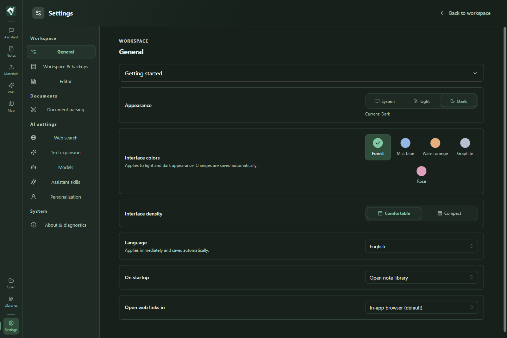

<details>
<summary>View the Chinese light interface</summary>

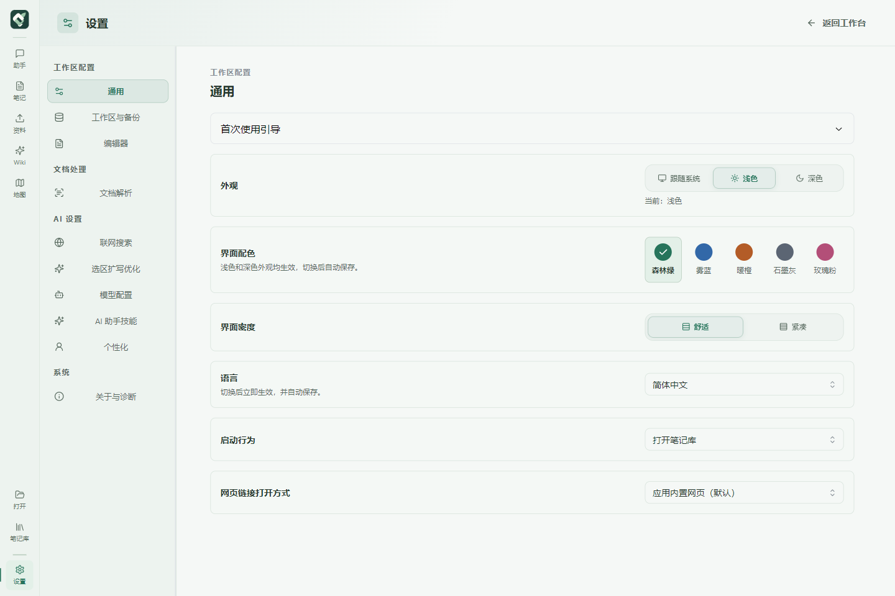

</details>

## Suggested workflow

1. **Write a note:** Create a library in Libraries and a Markdown note in Notes, or use Open for an existing text file.
2. **Configure AI:** Add local Ollama or a remote connection in Settings → Models, test it, and save the relevant content-sharing consent for remote services.
3. **Ask a question:** Use open chat in Assistant or current-note AI beside a note. Onboarding also covers the menus, configuration, and first question.
4. **Import project materials:** Create a materials library, import documents, and finish parsing/indexing. Configure its embedding model if semantic retrieval is needed.
5. **Learn and retain:** Find evidence with knowledge-base questions, browse chapters in Wiki, and save useful answers as notes. Enable graph enrichment when you need cross-document relationships.

## Download

**Windows x64 · Trellora 1.0.0**

| Edition | Download | Usage |
| --- | --- | --- |
| Installer | [Download setup](downloads/Trellora-1.0.0-setup-x64.exe?raw=true) | Run the setup wizard and choose an installation directory |
| Portable | [Download portable](downloads/Trellora-1.0.0-portable-x64.exe?raw=true) | Download and run directly |

Release files are collected in [`downloads/`](downloads/README.md). Upload this directory with the source to GitHub to enable these downloads. [SHA-256 checksums](downloads/SHA256SUMS.txt) · [Release file manifest](downloads/release-manifest.json) · [GitHub Releases](https://github.com/Elevenoven/Trellora-plus/releases).

## Quick start

### Desktop packages

Choose a Windows x64 installer or portable package from [Download](#download).

See the [distribution, backup, and recovery guide](docs/桌面分发与备份恢复使用说明.md) for first launch, updates, and moving to another computer. Packages are designed to include the required Python runtime; end users do not need to deploy a Python web service. Configure Ollama or external services only when needed.

### Run from source

Prepare Windows x64, Git, Node.js, and pnpm. The lockfile uses v9; use pnpm 9 or later. Node.js 22 or 24 is suggested. Visual Studio C++ Build Tools may be needed when native prebuilt dependencies are unavailable.

```powershell
git clone https://github.com/Elevenoven/Trellora-plus.git
cd Trellora-plus
pnpm install
pnpm run rebuild:native
pnpm dev
```

`pnpm dev` starts Vite and Electron together. A browser-only page does not provide desktop filesystem, SQLite, Worker, or IPC capabilities.

For pipeline development and tests, prepare Python separately:

```powershell
python -m venv pipeline-python\.venv
.\pipeline-python\.venv\Scripts\python.exe -m pip install -r pipeline-python\requirements.txt
.\pipeline-python\.venv\Scripts\python.exe -m unittest discover -s pipeline-python\tests -v
```

The Worker prefers this virtual environment and communicates over NDJSON stdin/stdout. It does not start FastAPI or listen on a local HTTP port.

## Models and external services

| Capability | Current integrations | When needed |
| --- | --- | --- |
| Generation | Ollama; OpenAI, Anthropic, Google Gemini, DeepSeek, Moonshot, Qwen, Zhipu, SiliconFlow, OpenRouter, and custom compatible APIs | Answers, analysis, generation, and LLM-assisted stages |
| Protocols | Ollama Chat, OpenAI Responses / Chat Completions, Anthropic Messages, Google GenerateContent | Select by provider/model capability; features vary between protocols and models |
| Embedding | Local Ollama or supported remote vector services | Semantic note/materials retrieval and vector memory recall |
| Rerank | Optional reranking services | Reordering retrieval candidates |
| Web search | Zhipu, DuckDuckGo, SearXNG, Tavily, Baidu | Enabled web retrieval; some providers need keys or a self-hosted URL |
| PDF parsing | MinerU | Searchable PDF artifacts; separate consent is required to upload the complete PDF |

Generation, embedding, and rerank are configured separately. Existing materials vectors are bound to an embedding profile. Model changes build a new index generation, validate and activate it, and retain a rollback path rather than mixing incompatible vector spaces.

## Architecture

**[Read the detailed code architecture →](docs/architecture.en.md)** · [中文架构](docs/architecture.md)

The document includes process/module diagrams, UI → IPC → service → storage flows, pipelines, retrieval, Agent execution, memory, Wiki, graphs, recovery, packaging, and extension points.

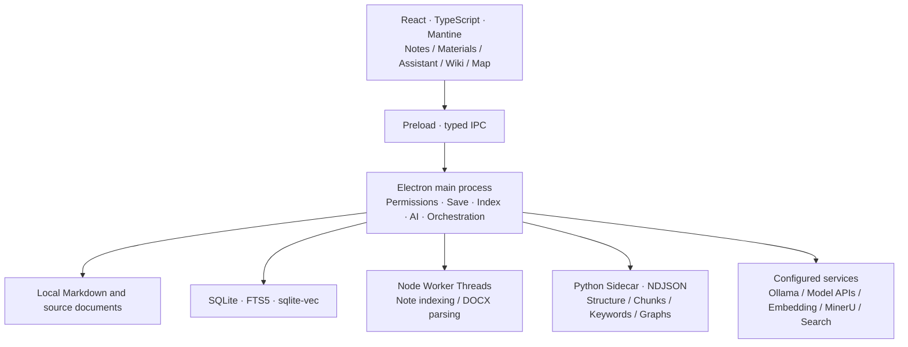

| Layer | Main technologies |
| --- | --- |
| Desktop/UI | Electron, React, TypeScript, Vite, Mantine, Lucide |
| Editing/rendering | Tiptap / ProseMirror, CodeMirror 6, remark / unified, KaTeX, Mermaid, DOMPurify |
| Index/retrieval | MiniSearch, better-sqlite3, SQLite FTS5, sqlite-vec |
| Document processing | Mammoth, PDF.js / docx-preview, Python, Jieba |
| AI | Multi-protocol adapters, ReAct loop, LangGraph-related orchestration |
| Graphs/visualization | igraph / Leiden, NetworkX, React Flow, force-directed layouts |

```text
src/              React UI, editor, Wiki, and i18n
electron/         Desktop lifecycle, files, IPC, AI, indexes, pipeline, recovery
shared/           Cross-process types, contracts, limits, and defaults
pipeline-python/  NDJSON Worker, processing stages, and Python tests
build/            Branding, built-in skills, and installer configuration
scripts/          Build, functional, Electron, and package validation
docs/             Product/architecture docs, showcase assets, acceptance records
```

## Data and privacy

| Data | Location and behavior |
| --- | --- |
| Original notes | Ordinary files in user-selected local libraries |
| Note metadata/indexes | Library `.menghan-meta/` |
| Materials and artifacts | Stored separately; artifacts under `.menghan-meta/pipeline/` |
| Conversation history/long-term memory | Workspace `ConversationMemory/qa-memory.db`; some legacy conversation stores remain compatible |
| Skills | Workspace `AI-Skill/` |
| Note backups | `.menghan-backups/`; full workspace backup is a separate workflow |
| Settings/keys/standalone recovery | Electron `userData`; keys are encrypted using `safeStorage` |

The first-launch default is `Trellora工作区` in Documents. Relocation copies workspace-owned data, validates and loads the new location, then activates it while retaining the original directory. External libraries retain their locations. Opening another workspace uses an existing workspace directly.

Remote AI sends scope-dependent questions, necessary document excerpts, selected attachments, and applicable context under saved per-model consent. Remote embeddings have separate consent, and PDF parsing requires separate permission to upload the full file. Local services follow the actual configured route.

Relocation blocks other operations while progressing; interrupted jobs can resume or keep the original location. Back up the workspace and relevant external libraries when moving computers. Historical `.menghan-meta`, `.menghan-backups`, and some protocol names remain for compatibility.

## Development and validation

```powershell
# Types and code quality
pnpm exec tsc -b
pnpm lint

# Select checks relevant to your changes
pnpm run verify:markdown
pnpm run verify:ai-provider
pnpm run verify:current-note-react-loop
pnpm run verify:pipeline-worker
pnpm run verify:wiki-workspace
```

Packaging needs release Worker dependencies in `.deps`, separately from the development `.venv`:

```powershell
python -m pip install -r pipeline-python\requirements.txt --target pipeline-python\.deps
pnpm build
pnpm run release:manifest
```

The runtime builder prefers CPython through Windows `py -3`; set `MENGHAN_PIPELINE_PYTHON` to a standalone CPython x64 `python.exe` when necessary. See [development and packaging](docs/architecture.en.md#development-build-and-validation) for ABI details and validation layers.

Versions come from `package.json.version`. Output names are `trellora/Trellora-<version>-portable-x64.exe` and `trellora/Trellora-<version>-setup-x64.exe`. The release manifest records hashes, sizes, runtime information, and signing status. Type checking and builds do not replace real-model, document-parsing, Windows association, or clean-machine acceptance.

## Documentation and participation

| Document | Content |
| --- | --- |
| [Code architecture](docs/architecture.en.md) · [中文](docs/architecture.md) | Diagrams, modules, built-in capabilities, data flows, extension points |
| [Product description](docs/Trellora-2.0-产品说明文档.md) | Product context and historical description; current menus follow this README and source |
| [Distribution, backup, recovery](docs/桌面分发与备份恢复使用说明.md) | First run, moving computers, backup/restore, updates |
| [Memory domain contract](docs/Trellora-2.0-WeKnora记忆架构严格对齐改造方案.md) | Implementation phases and numeric contracts |
| [Desktop acceptance](docs/verification/desktop-distribution-acceptance.md) | Verified behavior and remaining release gates |
| [Showcase assets](docs/assets/README.md) | Screenshot provenance and presentation references |

Report issues through [GitHub Issues](https://github.com/Elevenoven/Trellora-plus/issues), including version, UI language, reproduction steps, and relevant diagnostics without keys or private documents. Read [AGENTS.md](AGENTS.md) before contributing changes, particularly process responsibilities, original-content protection, and phased contracts.

The repository currently has no `LICENSE` file and has not declared an open-source license. Licensing and released versions follow future repository files and Releases.
