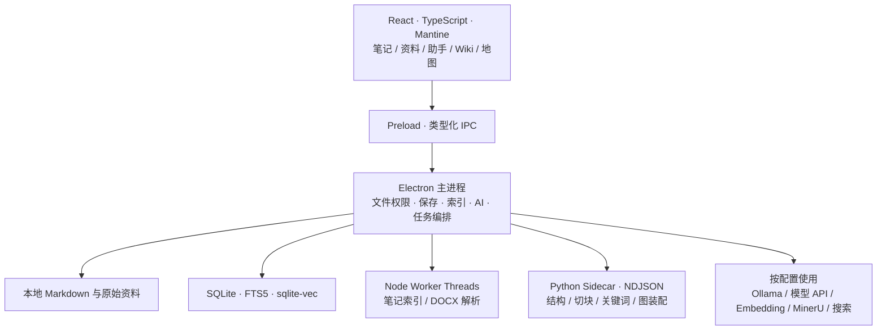

<div align="center">


# Trellora

**Windows 本地优先 AI 知识工作台**

Where ideas grow connected.

把 Markdown 笔记、项目资料、AI 问答和知识关联放进同一个桌面工作区。

**简体中文** · [English](README.en.md)

[](#快速开始)
[](#数据与隐私)
[](#技术架构)

[下载软件](#下载软件) · [产品功能](#产品功能) · [菜单与截图](#菜单与截图) · [快速开始](#快速开始) · [详细代码架构](docs/architecture.md) · [问题反馈](https://github.com/Elevenoven/Trellora-plus/issues)

</div>

## Trellora 是什么

Trellora 面向需要持续阅读、写作和整理资料的开发者、学生及知识工作者。你可以用普通 Markdown 文件记录想法，导入项目文档，通过检索和 AI 找到依据，再把回答保存成笔记、章节知识或可追溯的记忆。

产品围绕一条完整的知识工作流程展开：**收集资料 → 解析和索引 → 阅读与提问 → 整理为笔记 → 建立关联 → 持续复用**。笔记库用于主动写作，资料库用于保留和检索来源，Wiki 用于按章节学习，地图用于发现跨文档关系，助手把这些能力连接起来。

当前目标平台是 **Windows x64**，项目仍在持续开发。本文描述当前工作树的界面和实现；需要模型、Embedding、联网搜索或 PDF 云解析的功能，会在对应位置注明条件。正式分发状态以 [桌面分发验收记录](docs/verification/desktop-distribution-acceptance.md) 为准。


## 目录

- [下载软件](#下载软件)
- [产品功能](#产品功能)
- [菜单与截图](#菜单与截图)
- [推荐使用流程](#推荐使用流程)
- [快速开始](#快速开始)
- [模型与外部服务](#模型与外部服务)
- [技术架构](#技术架构)
- [数据与隐私](#数据与隐私)
- [开发与验证](#开发与验证)
- [文档与参与](#文档与参与)

## 产品功能

| 能力 | 可以完成的工作 |
| --- | --- |
| Markdown 写作 | 所见即所得、预览、源码编辑；表格、待办、代码、公式、Mermaid、Wiki 链接；实时字数、缩放、专注和打字机模式 |
| 本地文件与多库管理 | 创建和注册多个笔记库，浏览文件树、导入笔记、管理文件夹；无需建库即可打开独立文本文件 |
| 搜索与关联 | 本地关键词搜索、语义和综合检索；标签、反向链接、相关内容及资料实体图谱 |
| 文档流水线 | 文本与 DOCX 本地解析，PDF 经授权使用 MinerU；逻辑行、结构树、父子切块、关键词、向量与可选图谱增强 |
| AI 问答与写作 | 自由问答、当前笔记、个人知识库三种范围；流式回答、停止生成、工具过程、来源引用、附件与回答存为笔记 |
| Wiki 学习空间 | 章节目录与节点画布、原文阅读、节点分析、完整 Wiki 生成、章节重试、派生节点和学习成果整理 |
| 记忆与个性化 | 会话历史、历史对话搜索、长期记忆、原对话来源查看；手动保存、明确要求记住、可选自动提炼与待确认变更 |
| 桌面体验与恢复 | 中英文界面、深浅主题、五种配色、首次使用引导、笔记备份、工作区完整备份与恢复、存储迁移和诊断 |

基础编辑、文件浏览和笔记关键词搜索不要求配置 AI。向量检索需要 Embedding；AI 回答和生成需要可用模型；地图需要先在资料流水线启用并完成图谱增强。

## 菜单与截图

左侧导航包含 **助手、笔记、资料、Wiki、地图**，底部提供 **打开、笔记库、设置**。截图包含当前源码运行的 Electron 演示界面，以及用户提供的实际使用界面；同时展示中文、英文和不同主题。截图来源见 [展示资源说明](docs/assets/README.md)。

### 助手

用于提问、分析资料与把回答沉淀为笔记。主区域包含对话记录、问题导航、输入框、附件入口、资料范围、回答深度、思考模式和模型选择；历史入口用于查找和继续已有会话。

| 问答范围 | 内容来源 | 适合的任务 |
| --- | --- | --- |
| 自由问答 | 问题、主动添加的附件与适用的会话上下文 | 通用咨询、写作、解释与分析 |
| 当前笔记 | 当前笔记及按需读取的章节 | 总结、解释、检查和围绕当前内容继续提问 |
| 个人知识库 | 选定资料库中的检索证据 | 跨文档归纳、查找项目依据、生成学习资料 |

回答可以流式显示并随时停止，资料引用可定位来源。复杂问题可展示计划和工具调用；可选联网搜索补充公开信息。回答支持编辑后存入选定笔记库。长期记忆引用与文档证据分别展示，便于查看它们各自的来源。


### 笔记

用于日常写作和管理 Markdown 笔记。左侧是笔记库选择、文件树、文档目录、搜索、标签、新建笔记和文件夹、导入及刷新；中间是编辑器；右侧可查看笔记信息和当前笔记 AI 助手。

- **编辑 / 预览 / 源码**：Tiptap 所见即所得编辑、Markdown 渲染和 CodeMirror 源码编辑。
- **写作内容**：标题、列表、待办、引用、链接、图片、表格、代码高亮、KaTeX 公式、Mermaid 与 Wiki 链接。
- **写作工具**：实时字数、缩放、目录定位、选区工具栏、AI 选区变换与扩写、专注模式和打字机模式。
- **笔记信息**：文件信息、标签、内容概览与智能建议；AI 生成部分需要配置模型。
- **保存与输出**：库内自动保存、保存状态、备份恢复，以及导出菜单中的输出能力（包括 HTML）。


阅读和编辑笔记时，可在右侧围绕当前笔记提问，或选择总结、概括、学习路径与整理建议等预置任务。


### 资料

用于管理作为知识来源的文档。页面提供资料库列表、文档列表、搜索和排序、上传、重新扫描、重命名、删除、文档预览，以及流水线配置、状态和阶段产物查看。

文本文件直接在本机解析，DOCX 由 Mammoth Worker Thread 在本机解析。PDF 可先导入和预览；建立可检索内容时，当前解析路线使用需要单独配置和上传授权的 MinerU 云服务。

流水线按配置执行解析、逻辑行、结构信号、歧义处理、结构树、父子切块、关键词、向量与实体处理；界面展示真实阶段状态、进度、错误、取消和重试。解析产物保存在资料库的 `.menghan-meta/` 下，原文不会被处理阶段覆盖。图谱增强和 LLM 辅助处理属于可选配置。


### Wiki

用于把已建立结构索引的资料展开成可以浏览和学习的章节空间。选择资料库与文档后，左侧显示文档目录，中心显示章节节点与父子关系；可以搜索节点、折叠章节、缩放、适配视图及调整同级章节顺序。

Wiki 提供节点分析与完整 Wiki 生成，支持引导式和自动模式。节点可查看原文、围绕当前章节提问、执行快捷分析，生成结果可形成派生节点或保存为 Wiki AI 内容；章节任务支持取消和失败重试。文档还可以导入笔记库，继续编辑和整理。

**结构浏览使用本地解析结果；AI 分析和生成另需可用模型。** Wiki 的章节树与“地图”的跨文档实体图谱是不同的浏览入口。


### 地图

用于探索资料库中的实体、关系和社区。页面包含资料库选择、社区视图 / 实体视图切换、实体搜索、文档筛选、节点详情与视图适配；可通过点击、拖动和社区展开查看联系。

先在资料流水线启用图谱增强，完成实体处理和库级图装配，再展示图谱。图谱也能为助手提供局部实体检索和全局社区检索。社区摘要帮助理解整体主题，回答依据仍需要回到资料原文。

下图展示**尚未生成图谱时的实际界面**，包含需要完成的前置步骤。


### 打开

用于直接打开本地 MD、Markdown、TXT 及其他受支持的文本文件，快捷键为 `Ctrl+O`。下拉菜单还包含最近文件、恢复独立文件草稿和待打开文件队列。

独立文件工作区显示文件路径、编码、换行格式、保存状态和字数，提供编辑 / 预览 / 源码、保存、另存为和加入笔记库。独立 Markdown 支持受控的本地图片访问、图片粘贴与文档 AI。**独立文件编辑先保存恢复草稿，原文件通过手动保存写回**，与库内笔记自动保存区分。

Windows 启动参数和拖放共用打开队列；安装包提供 `.md`、`.markdown`、`.txt` 的可选打开方式注册。


### 笔记库

用于管理全部已注册笔记库。页面显示名称、磁盘位置、笔记数量、最近打开时间和可用状态，可按名称或路径搜索并分页查看。

可以创建笔记库、进入已有库、复制位置、移除注册，并从库操作入口升级为资料库。**移除笔记库注册会保留磁盘上的笔记文件**。笔记库管理入口独立于文件侧栏，折叠侧栏后仍然可用。


### 设置

设置按照工作区配置、文档处理、AI 设置和系统分组，共有十个子菜单：

| 子菜单 | 功能与内容 |
| --- | --- |
| 通用 | 首次使用引导；跟随系统、浅色或深色；五种配色；舒适 / 紧凑密度；简体中文 / English；启动行为和网页链接打开方式 |
| 工作区与备份 | 工作区位置、打开目录、更改存储位置、打开其他工作区、完整备份与恢复及关联外部库的处理 |
| 编辑器 | 默认编辑模式、自动保存延迟、预览偏好、正文字号、行距、段落间距、默认缩放、粘贴行为、Markdown 自动格式化、选区工具栏、专注和打字机模式 |
| 文档解析 | MinerU 配置、连接与上传同意，以及文档处理相关能力状态 |
| 联网搜索 | 搜索服务商、连接信息、可用性验证和服务商专属参数 |
| 选区扩写优化 | 目标长度、写作风格、目标读者、思考强度和扩写相关设置 |
| 模型配置 | 多个模型连接、默认模型、服务商与协议、Base URL、模型列表、连接测试、上下文窗口；Embedding、Rerank 及资料库向量配置 |
| AI 助手技能 | 内置与自定义技能、启用范围、导入和编辑，以及生成风格配置 |
| 个性化 | 用户信息、长期记忆开关与保存方式、记忆管理、来源查看、待确认变更、提炼与整理 |
| 关于与诊断 | 产品和版本信息、能力检查、日志与诊断、发布检查相关入口 |

**界面语言切换路径：设置 → 通用 → 语言。** 切换立即生效并持久保存，笔记和资料原文保持原语言。README 与架构文档分别通过顶部的 `简体中文 / English` 链接切换。


<details>
<summary>查看 English 深色界面</summary>


</details>

## 推荐使用流程

1. **写一篇笔记**：在“笔记库”创建库，在“笔记”中新建 Markdown，或用“打开”直接编辑已有文本。
2. **配置 AI**：在“设置 → 模型配置”添加本地 Ollama 或远程模型，测试连接；远程服务需要保存对应内容发送同意。
3. **提一个问题**：在“助手”选择自由问答，或在笔记旁使用当前笔记问答。首次使用引导也会带你完成菜单认识、AI 配置和第一次提问。
4. **导入项目资料**：在“资料”创建资料库，导入文档并完成解析和索引。需要语义检索时，配置该资料库的 Embedding。
5. **继续学习和沉淀**：用知识库问答查依据，用 Wiki 浏览章节，把有价值的回答保存为笔记；需要跨文档关系时启用图谱增强。

## 下载软件

**Windows x64 · Trellora 1.0.0**

| 版本 | 下载 | 使用方式 |
| --- | --- | --- |
| 安装版 | [下载安装包](downloads/Trellora-1.0.0-setup-x64.exe?raw=true) | 运行安装向导，可选择安装目录 |
| 免安装版 | [下载 portable](downloads/Trellora-1.0.0-portable-x64.exe?raw=true) | 下载后直接运行 |

发行文件统一存放在 [`downloads/`](downloads/README.md)，将该目录随源码上传到 GitHub 后即可点击下载。[SHA-256 校验值](downloads/SHA256SUMS.txt) · [发行文件清单](downloads/release-manifest.json) · [GitHub Releases](https://github.com/Elevenoven/Trellora-plus/releases)。

## 快速开始

### 使用桌面包

请从[下载软件](#下载软件)选择 Windows x64 安装版或免安装版。

首次启动、备份、换电脑恢复和更新操作见 [桌面分发与备份恢复使用说明](docs/桌面分发与备份恢复使用说明.md)。发行包设计为携带所需 Python runtime，最终用户无需自行搭建 Python Web 服务。Ollama 和各类远程服务按需要配置。

### 从源码启动

准备 Windows x64、Git、Node.js 和 pnpm（lockfile 为 v9，使用 pnpm 9 或更高版本）。Node.js 建议使用 22 或 24；原生模块没有可用预编译产物时，需要 Visual Studio C++ Build Tools。

```powershell
git clone https://github.com/Elevenoven/Trellora-plus.git
cd Trellora-plus
pnpm install
pnpm run rebuild:native
pnpm dev
```

`pnpm dev` 同时启动 Vite 和 Electron。仅启动浏览器页面不会提供本地文件、SQLite、Worker 和桌面 IPC 能力。

开发和测试文档流水线时，再准备 Python 环境：

```powershell
python -m venv pipeline-python\.venv
.\pipeline-python\.venv\Scripts\python.exe -m pip install -r pipeline-python\requirements.txt
.\pipeline-python\.venv\Scripts\python.exe -m unittest discover -s pipeline-python\tests -v
```

Worker 优先使用上述虚拟环境，经 NDJSON 标准输入输出通信，不启动 FastAPI 或监听本地 HTTP 端口。

## 模型与外部服务

| 能力 | 当前接入方式 | 什么时候需要 |
| --- | --- | --- |
| 生成模型 | Ollama；OpenAI、Anthropic、Google Gemini、DeepSeek、Moonshot、通义千问、智谱、SiliconFlow、OpenRouter、自定义兼容 API | AI 回答、分析、生成和 LLM 辅助阶段 |
| 模型协议 | Ollama Chat、OpenAI Responses / Chat Completions、Anthropic Messages、Google GenerateContent | 按服务商和模型能力选择；并非全部功能在全部协议上相同 |
| Embedding | 本地 Ollama 或受支持的远程向量服务 | 笔记 / 资料语义检索与长期记忆向量召回 |
| Rerank | 可选配置的重排序服务 | 改善检索候选排序 |
| 联网搜索 | 智谱、DuckDuckGo、SearXNG、Tavily、百度 | 用户启用联网检索时；部分服务需要 Key 或自建地址 |
| PDF 解析 | MinerU | 将 PDF 转换为后续流水线所需的可检索产物；上传前需单独同意 |

生成模型、Embedding 和 Rerank 分别配置。资料库已有向量绑定模型档案，换模型通过建立新索引代际、校验后激活和可选回滚完成，避免用不同模型的向量直接混查。

## 技术架构

**[阅读完整代码架构文档 →](docs/architecture.md)** · [English architecture](docs/architecture.en.md)

文档包含进程与模块架构图、UI → IPC → 服务 → 文件 / 数据库调用链、文档流水线、检索、Agent、记忆、Wiki、图谱、恢复、打包和扩展入口。



| 层次 | 主要技术 |
| --- | --- |
| 桌面与 UI | Electron、React、TypeScript、Vite、Mantine、Lucide |
| 编辑与渲染 | Tiptap / ProseMirror、CodeMirror 6、remark / unified、KaTeX、Mermaid、DOMPurify |
| 索引与检索 | MiniSearch、better-sqlite3、SQLite FTS5、sqlite-vec |
| 文档处理 | Mammoth、PDF.js / docx-preview、Python、Jieba |
| Agent 与模型 | 多协议模型适配、ReAct 执行循环、LangGraph 相关编排 |
| 图谱与可视化 | igraph / Leiden、NetworkX、React Flow、力导向布局 |

```text
src/              React 界面、编辑器、Wiki 与 i18n
electron/         桌面生命周期、文件、IPC、AI、索引、流水线与恢复
shared/           跨进程类型、配置合同、限额和默认值
pipeline-python/  NDJSON Worker、结构化阶段与 Python 测试
build/            品牌资源、内置技能与安装器配置
scripts/          构建、功能验证、Electron 与发行包验证
docs/             产品、架构、展示资源和实施验收记录
```

## 数据与隐私

| 数据 | 位置与行为 |
| --- | --- |
| 笔记原文 | 用户选择的普通本地笔记库，以 Markdown 等文件保存 |
| 笔记元数据与索引 | 笔记库 `.menghan-meta/` |
| 原始资料与流水线产物 | 资料库中分别保存；阶段产物位于 `.menghan-meta/pipeline/` |
| 问答历史与长期记忆 | 工作区 `ConversationMemory/qa-memory.db`；部分旧库会话存储保留兼容 |
| 技能文件 | 工作区 `AI-Skill/` |
| 库内笔记备份 | `.menghan-backups/`；完整工作区备份使用独立流程 |
| 设置、密钥与独立文件恢复草稿 | Electron `userData`；API Key 通过 `safeStorage` 加密保存 |

首次启动默认使用“文档”目录中的 `Trellora工作区`。设置里的“更改存储位置”会迁移工作区内数据，校验并加载成功后启用新位置，保留原目录；外部已注册库继续关联原位置。“打开其他工作区”用于直接使用已有工作区。

使用远程 AI 时，按当前问答范围发送问题、必要文档片段、主动添加的附件及适用的上下文；同意按模型配置保存。远程 Embedding 有独立同意控制，PDF 解析另需允许完整文件上传。选择本地服务时，仍需按实际配置确认数据路线。

迁移时显示阻止其他操作的进度弹窗，中断后可继续迁移或使用原位置。换电脑时，应完整备份工作区及相关外部笔记库。历史目录名 `.menghan-meta`、`.menghan-backups` 和部分协议名保留用于数据兼容。

## 开发与验证

```powershell
# 类型和代码检查
pnpm exec tsc -b
pnpm lint

# 按修改范围选择验证脚本
pnpm run verify:markdown
pnpm run verify:ai-provider
pnpm run verify:current-note-react-loop
pnpm run verify:pipeline-worker
pnpm run verify:wiki-workspace
```

Windows 打包需要为发布 Worker 准备 `.deps`（与开发 `.venv` 分开）：

```powershell
python -m pip install -r pipeline-python\requirements.txt --target pipeline-python\.deps
pnpm build
pnpm run release:manifest
```

构建脚本优先通过 Windows `py -3` 定位 CPython；必要时将 `MENGHAN_PIPELINE_PYTHON` 指向独立 CPython x64 的 `python.exe`。常见构建排查、原生依赖与验收分层见 [代码架构：开发与打包](docs/architecture.md#开发构建与验证)。

产物版本取自 `package.json.version`，输出格式为 `trellora/Trellora-<version>-portable-x64.exe` 和 `trellora/Trellora-<version>-setup-x64.exe`。发行清单记录实际包的哈希、大小、运行时和签名状态。类型检查与构建不替代真实模型、文档解析、Windows 文件关联及干净机器验证。

## 文档与参与

| 文档 | 内容 |
| --- | --- |
| [代码架构](docs/architecture.md) · [English](docs/architecture.en.md) | 架构图、模块、内置功能、数据流程和开发入口 |
| [产品说明](docs/Trellora-2.0-产品说明文档.md) | 产品定位、场景与历史产品说明；当前菜单以本文和源码为准 |
| [分发、备份与恢复](docs/桌面分发与备份恢复使用说明.md) | 首次运行、换电脑、备份恢复和更新 |
| [记忆域主合同](docs/Trellora-2.0-WeKnora记忆架构严格对齐改造方案.md) | 记忆改造阶段与数值合同 |
| [桌面分发验收](docs/verification/desktop-distribution-acceptance.md) | 已验证项目与仍待完成的发行门 |
| [展示资源说明](docs/assets/README.md) | 截图来源、演示数据及 README 编排参考 |

反馈问题时，请在 [GitHub Issues](https://github.com/Elevenoven/Trellora-plus/issues) 附上应用版本、界面语言、复现步骤和相关诊断；避免包含密钥或私人资料。提交代码前阅读 [AGENTS.md](AGENTS.md)，遵守进程职责、用户原文保护及分阶段合同。

当前仓库没有 `LICENSE` 文件，暂未声明开源许可证。许可证和正式发布状态以后续仓库文件及 Releases 为准。
