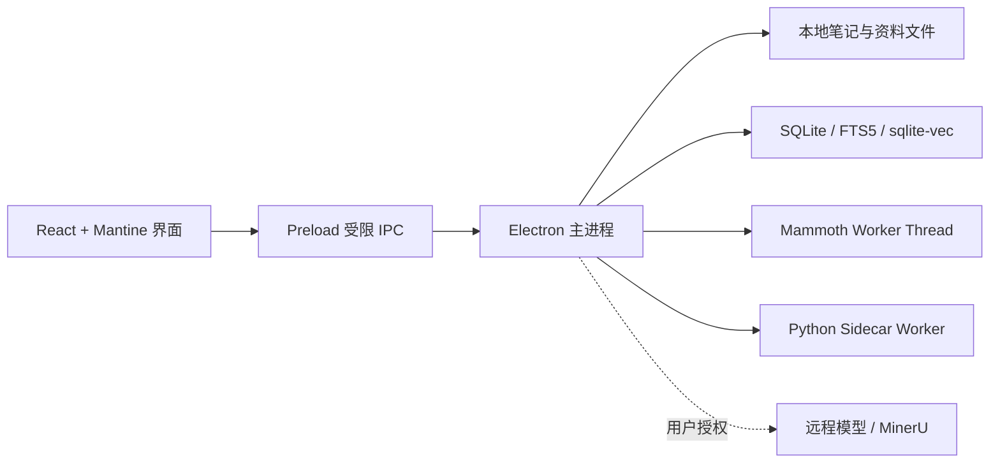

# Trellora 2.0 产品说明文档

> 文档类型：简要产品说明  
> 适用平台：Windows x64  
> 更新日期：2026-08-27  
> 事实基线：当前工作区源码、README、依赖与打包配置（包含尚未提交的开发中改动）

> 状态口径：正文中的“支持”表示当前源码已存在对应界面或实现，不等同于正式发布版已经通过运行验收；灰度、仅配置、规划中和待验收能力在第 8 节单独标明。

## 1. 产品概述

Trellora 2.0 是一款面向个人与专业知识工作者的 **Windows 本地优先、AI 原生 Markdown 知识管理应用**。它以普通文件夹和 Markdown 文件保存用户内容，在提供富文本写作、文件管理、全文检索和知识关联能力的同时，引入资料解析流水线与可选择数据范围的 AI 助手，覆盖“记录—整理—检索—理解—复用”的主要知识工作环节。

产品的核心承诺是：

- **内容归用户所有**：Markdown 和原始资料保存在用户可见的本地目录中，不依赖账号或私有云数据库。
- **本地能力优先**：笔记编辑、文件管理、关键词搜索和本地索引不要求联网；AI 可使用本地 Ollama，也可由用户主动配置远程模型。远程 AI、远程 Embedding 和 MinerU PDF 解析会把完成任务所需的内容发送给第三方，并非全程离线。
- **原文与系统产物分离**：索引、向量、AI 结果、会话记忆和流水线产物独立保存，不会静默覆盖原始笔记或资料。
- **AI 范围可控**：用户可以选择自由问答、当前笔记问答或指定个人知识库问答；远程发送与 PDF 云解析均有独立配置和授权边界。

## 2. 目标用户与核心价值

### 2.1 目标用户

- 需要长期管理工作记录、技术文档、研究资料和个人知识的用户。
- 希望获得接近现代文档工具的编辑体验，又不愿被云端账号或专有格式绑定的用户。
- 经常阅读 Markdown、PDF、DOCX、代码或结构化文本，并希望通过 AI 快速理解和复用内容的用户。
- 对数据位置、隐私边界、模型来源和 AI 调用范围有明确控制要求的用户。

### 2.2 用户价值

| 用户问题 | Trellora 的解决方式 |
| --- | --- |
| 笔记散落、难以迁移 | 直接使用本地文件夹和 Markdown，便于复制、备份、同步及被其他工具读取 |
| 长文和多笔记难以定位 | 通过目录、标签、Wiki 链接、反向链接、全文/语义搜索和相关笔记建立导航 |
| 外部资料难以沉淀 | 将资料导入个人知识库，经解析、结构识别、切块、关键词和索引流水线转为可检索内容 |
| AI 回答缺少上下文控制 | 明确区分自由问答、当前笔记和指定知识库，并显示会话、计划、工具过程及引用定位 |
| 担心 AI 修改或泄露原文 | AI 产物与原文件分离；写入标签等操作需要确认；远程模型与 PDF 云解析需要显式配置 |

## 3. 产品信息架构

应用当前提供五个主要入口：

1. **首页**：管理系统工作区和多个笔记库，继续最近阅读，查看索引状态。
2. **笔记**：以文件树、编辑区和右侧知识面板组成日常写作工作台。
3. **资料**：创建个人知识库，导入、预览、解析和检索外部文档。
4. **问答**：进行普通 AI 问答，或选择一个个人知识库进行基于资料的问答。
5. **设置**：管理工作区、编辑器、用户信息、文档解析、模型、AI Skill、MCP 配置、索引和诊断。

导航中的 **Wiki** 与 **知识地图** 当前仍标记为后续阶段入口，不应视为正式开放功能。

## 4. 核心功能

### 4.1 本地笔记工作台

- 支持创建、注册和切换多个本地笔记库。
- 支持文件夹、新建页面、导入、重命名、拖放移动、自定义排序、收藏和移入 Windows 回收站。
- Markdown 笔记支持三种模式：Tiptap 富文本编辑、渲染预览和 CodeMirror 源码编辑。
- 编辑器支持标题、列表、待办、引用、代码块、表格、链接、图片粘贴/拖入、斜杠命令及撤销重做。
- 预览支持 GFM、代码高亮、KaTeX 公式、Mermaid 图表和安全 HTML 清理。
- 支持自动保存、保存前备份、历史恢复和 HTML 导出。
- 支持标签、Wiki 链接、反向链接、文档目录、相关笔记和库级搜索。

### 4.2 搜索与知识关联

- **关键词搜索**：基于本地 MiniSearch，核心搜索不依赖 AI。
- **语义搜索**：使用 SQLite、sqlite-vec 和用户配置的 Embedding 模型建立本地向量索引。
- **综合搜索**：结合关键词与语义结果；语义能力不可用时仍可继续使用关键词搜索。
- **相关笔记**：综合链接、标签、实体和语义内容查找关联笔记。
- **知识分析**：可生成摘要、标签建议、实体与关系；标签写回 Markdown 前需要用户确认。

### 4.3 资料库与文档处理

- 支持新建个人资料库，或将已有笔记库一次性复制为独立资料库；“升级”不会修改原笔记库，也不会在两者之间建立持续同步关系。
- 支持导入常见文档和文本资料，并提供列表、筛选、排序、重命名、删除、重新扫描资料目录和文档预览。可导入不代表一定能够进入完整解析与问答链路。
- 当前可进入完整解析链路的格式为：
  - Markdown、TXT、JSON、CSV、YAML、HTML 等文本：本机直接读取；
  - DOCX：由本机 Mammoth Worker Thread 解析；
  - PDF：经用户授权后交给 MinerU 云 API 解析。
- 解析后的标准流水线包括：统一文档、逻辑行、结构识别、章节树、父子切块、关键词索引和可选向量索引。
- 支持真实进度、阶段状态、取消、失败重试、缓存复用、配置变更后的下游失效和分页产物预览。
- 每个资料库可测试并锁定独立的向量模型配置，避免文档向量和查询向量由不兼容的模型生成。向量索引保存在本地；若选择远程 Embedding，生成向量所需的文本仍会发送给所选服务。

### 4.4 AI 助手

AI 助手提供三种主要工作范围：

| 模式 | 使用的数据 | 典型用途 |
| --- | --- | --- |
| 自由问答 | 用户问题及主动添加的文本附件 | 通用咨询、写作和分析 |
| 当前笔记 | 当前已保存笔记及按需读取的章节/正文 | 问答、完整总结、快速概括、解释与继续推理 |
| 个人知识库 | 用户选定资料库中的父子块、关键词或向量检索结果 | 跨文档问答、学习路径和资料归纳 |

助手还支持：

- 模型、回答深度和思考强度选择。
- 最多按需选择若干 AI Skill，将完整工作约束仅加载到本轮请求。
- 流式回答、停止生成、建议追问、引用定位和可展开的计划/工具执行轨迹。
- 当前笔记会话记忆与统一问答历史，包括新建、恢复、重命名、置顶、分页和删除。
- 本地持久化、仅本次启动或不使用记忆三种记忆模式。
- 用户信息维护、证据和修订记录等个性化能力已进入当前开发工作区，但仍应按预发布能力看待。自动提取和问答注入默认关闭；用户可在设置中查看、修改、锁定、删除、导入、导出或清空相关信息。

### 4.5 模型、扩展与诊断

- 支持本地 Ollama，以及 OpenAI、Anthropic、Gemini、DeepSeek、Moonshot、通义千问、智谱、SiliconFlow、OpenRouter 和自定义兼容 API。
- 生成、Embedding 与 Rerank 可分别配置；远程模型密钥通过 Electron `safeStorage` 保存，界面不回显明文。
- 支持创建、启用和编辑本地 AI Skill，并同步为系统工作区内的可读文件。
- MCP 页面已支持连接信息和工具白名单配置；其中本地 stdio 当前界面明确为“仅保存”，不能据此认定所有 MCP 工具已具备完整运行能力。
- 提供日志目录、运行环境、索引状态和不含笔记正文/API Key 的诊断报告导出。

## 5. 关键用户流程

### 5.1 写作与知识沉淀

```text
创建/选择笔记库 → 新建或导入笔记 → 编辑并自动保存
→ 标签/Wiki/目录组织 → 本地搜索或相关笔记发现 → 备份与恢复
```

### 5.2 当前笔记 AI 问答

```text
打开笔记 → 切换右侧“AI 助手” → 选择模型、Skill 与回答方式
→ AI 按计划调用受控读取工具获取相关章节 → 流式回答 → 点击引用回到原文
```

### 5.3 资料入库与知识库问答

```text
创建资料库 → 上传文档 → 系统按格式选择解析路由并提示所需授权 → 生成结构化阶段产物
→ 建立 FTS5/向量索引 → 在资料页或问答页选择该知识库 → 基于原文块回答
```

## 6. 数据、隐私与安全边界

### 6.1 主要数据位置

| 数据 | 默认位置与说明 |
| --- | --- |
| 笔记原文 | 用户注册的笔记库；可位于系统工作区内，也可位于用户指定的其他本地目录 |
| 图片与备份 | 每个笔记库内的 `image/` 和 `.menghan-backups/` |
| 笔记索引、AI 结果、当前笔记会话 | 每个笔记库内的 `.menghan-meta/` |
| 个人资料库 | 系统工作区的 `knowledge-base/`，包含原始副本、流水线产物和本地索引 |
| 统一问答历史与用户信息 | 系统工作区的 `ConversationMemory/` |
| AI Skill | 系统工作区的 `AI-Skill/` |
| API Key | 操作系统安全存储，由 Electron `safeStorage` 管理，不保存在上述普通配置文件中 |

完整迁移时应同时备份系统工作区和所有位于工作区之外的已注册笔记库；只复制其中一处可能遗漏原文、备份、索引或会话记忆。

### 6.2 安全原则

- React 渲染进程不能直接访问 Node.js 或文件系统，只能通过受限 preload IPC 调用主进程能力。
- 主进程校验资料库注册、允许格式、文件名和路径边界，防止越权访问及路径穿越。
- Python Worker 只处理 Electron 分配的输入和临时输出，不直接写应用 SQLite，也不修改用户原始文件。
- 阶段产物先写临时目录，校验后再提交；索引与大体积阶段文件分开保存。
- 远程 AI 内容发送、Embedding 调用和 PDF 云解析分别受配置与用户同意状态控制。PDF 会上传原始文件供 MinerU 处理；第三方留存、计费和服务条款由对应服务商决定，使用前需另行确认。
- 外部网页在隔离窗口中打开，不复用主应用的本地文件 IPC 权限。

## 7. 技术架构概览



- **渲染进程**：负责界面、编辑器、预览和用户交互，不直接接触系统权限。
- **Electron 主进程**：负责应用生命周期、文件操作、索引、模型调用边界、任务队列、取消/重试和状态发布。
- **Mammoth Worker Thread**：负责本地 DOCX 解析，避免阻塞主进程。
- **Python Sidecar**：负责逻辑行、结构树、父子切块、关键词等后续结构化阶段，通过 NDJSON 协议与 Electron 通信。
- **SQLite/FTS5/sqlite-vec**：保存可检索元数据、倒排索引和向量；原始文档仍是事实来源。

## 8. 运行条件与能力边界

### 8.1 运行条件

- 目标系统：Windows x64。
- 发布目标：提供单个 portable 分发文件，并在包内携带资料流水线所需运行时；“单个分发文件”不代表应用内部没有 Worker 或配套资源。
- 基础笔记功能无需登录；本地 AI 需要可用的 Ollama，远程 AI 需要用户自行配置服务与密钥。
- PDF 结构化解析依赖 MinerU 云服务和用户明确授权；DOCX 解析在本机完成。

### 8.2 当前状态说明

| 状态 | 能力 |
| --- | --- |
| 当前源码已接入 | 多笔记库、三模式编辑、备份恢复、标签/Wiki/反向链接、关键词/语义搜索、资料库、文档流水线、当前笔记/知识库/自由问答、会话记忆、模型与 Skill 配置 |
| 灰度或 Beta | 整库 Planner 路由、自适应上下文、统一上下文投影、用户信息自动提取，以及部分新记忆治理能力 |
| 配置层已存在 | MCP 连接与工具白名单；实际运行能力需按传输方式和后续接入逐项验收 |
| 规划中 | 独立 Wiki 工作区、正式知识地图入口、多人协作、云同步、Web 与移动端 |

当前仓库存在较多未提交的 AI 记忆、用户信息和文档流水线改动。因此，本说明描述的是 **当前开发工作区的产品形态**，不能替代以下发布验收：

- 干净 Windows x64 环境 portable 启动与升级验证；
- 真实 DOCX/PDF 解析、Python 进程生命周期和断点恢复验证；
- 本地/远程模型、长上下文、会话记忆和资料库问答的端到端验证；
- `pnpm exec tsc -b`、`pnpm lint`、专项验证脚本和 Python 单元测试。

## 9. 当前非目标

- 不提供多人实时协作、团队权限和云端账号体系。
- 不提供官方云同步；用户可自行使用文件同步工具，但需自行处理并发冲突。
- 不以数据库替代用户原始 Markdown 或资料文件。
- 不允许 AI 在无确认的情况下批量改写、移动或删除用户笔记。
- 不将当前禁用的 Wiki、知识地图导航或仅保存的 MCP 配置描述为已正式交付。

## 10. 主要事实来源

- `README.md`：产品定位、开发与发布说明。
- `src/App.tsx`、`src/components/NavRail.tsx`：主导航、笔记工作台和页面编排。
- `src/components/KnowledgePanel.tsx`、`src/components/AssistantWorkspaceView.tsx`：当前笔记助手与统一问答工作区。
- `src/components/MaterialsView.tsx`、`src/components/MaterialsPipelineView.tsx`：资料库、文档预览和流水线界面。
- `electron/main.ts`、`electron/preload.ts`、`src/electron.d.ts`：主进程能力、IPC 暴露与类型边界。
- `electron/pipeline/`、`pipeline-python/pipeline_worker/`：文档解析、结构化流水线与 Worker 协议。
- `electron/knowledge/`：搜索、索引、AI、记忆、用户信息和知识库问答实现。
- `package.json`：依赖、验证脚本和 Windows portable 打包配置。
