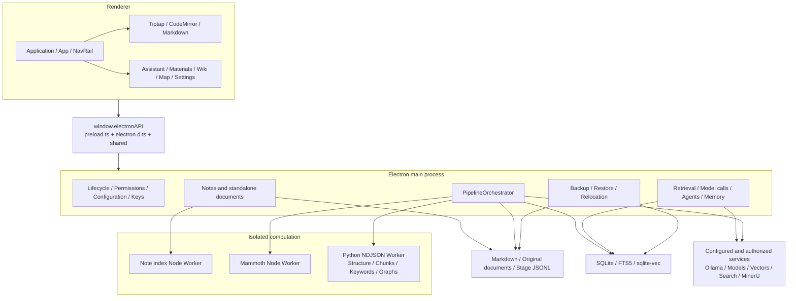
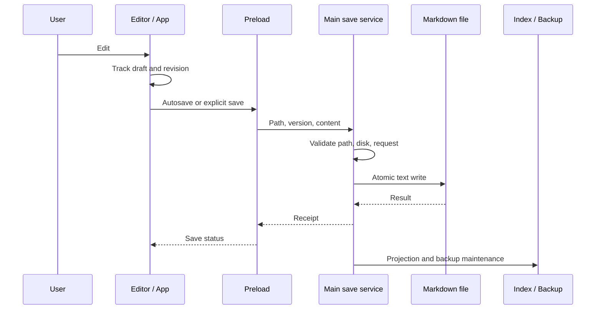
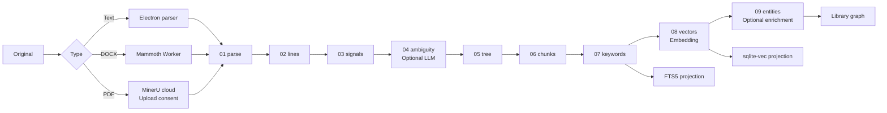
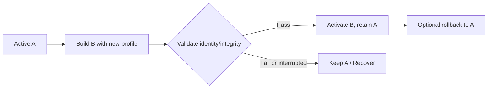
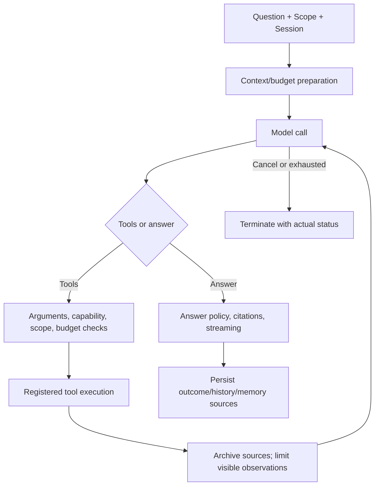
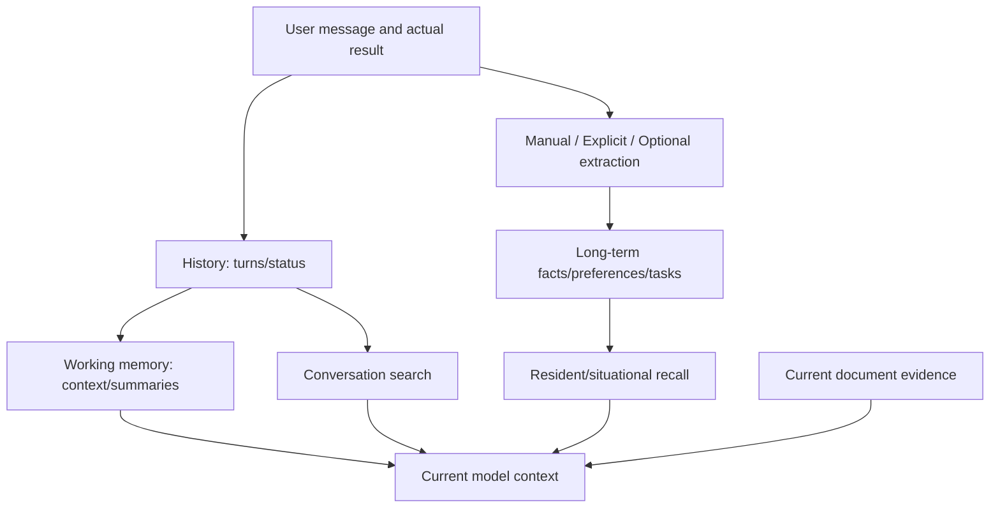
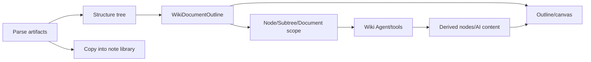
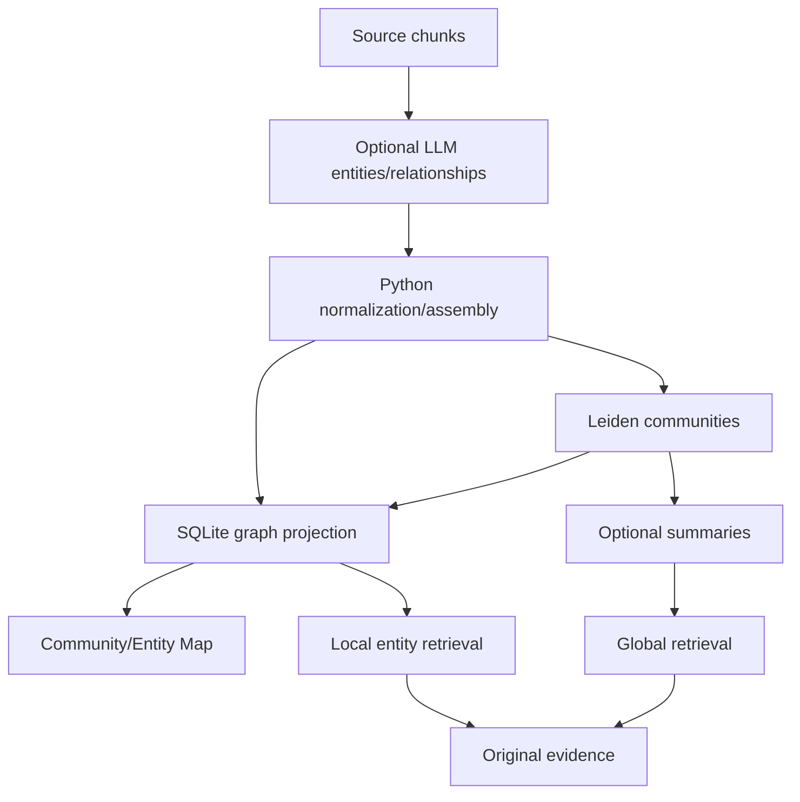

# Trellora Code Architecture and Built-in Capabilities

[简体中文](architecture.md) · **English** · [Product README](../README.en.md)

This document describes the working tree inspected on 2026-10-05. Repository-relative links lead to implementation; Mermaid diagrams render on GitHub. Current implementation takes precedence over older design assumptions. Memory changes follow the [memory domain contract](Trellora-2.0-WeKnora记忆架构严格对齐改造方案.md).

## Contents

- [Overall architecture and process boundaries](#overall-architecture-and-process-boundaries)
- [Directories and responsibilities](#directories-and-responsibilities)
- [UI and IPC](#ui-and-ipc)
- [Note editing and saving](#note-editing-and-saving)
- [Standalone documents](#standalone-documents)
- [Materials and document pipeline](#materials-and-document-pipeline)
- [Keyword semantic retrieval and vector generations](#keyword-semantic-retrieval-and-vector-generations)
- [Model gateway and AI Agents](#model-gateway-and-ai-agents)
- [History working memory and long-term memory](#history-working-memory-and-long-term-memory)
- [Wiki workspace](#wiki-workspace)
- [Materials graph and Map](#materials-graph-and-map)
- [Built-in skills and web capabilities](#built-in-skills-and-web-capabilities)
- [Data layout and recovery](#data-layout-and-recovery)
- [Themes language and onboarding](#themes-language-and-onboarding)
- [Development build and validation](#development-build-and-validation)
- [Extension and reading guide](#extension-and-reading-guide)

## Overall architecture and process boundaries

Trellora is a **local-first Windows Electron desktop application**. React owns interaction; Electron owns filesystem/database access; Node Workers and a Python Sidecar perform isolated computation. Core operation requires no separate web backend, Redis, PostgreSQL, or external vector database.



| Unit | Responsibility | Boundary |
| --- | --- | --- |
| Renderer | Status, editing, actions, diagrams, conversations | No arbitrary filesystem access, Python spawning, service keys |
| Preload | Named methods/events through `contextBridge` | No general `fs`, `spawn`, unrestricted IPC |
| Main | Files, databases, models, queues, sessions, recovery | Validates operations; UI controls do not replace access checks |
| Node Workers | DOCX parsing and note-index computation | Return results under main-process coordination |
| Python Sidecar | Lines, signals, structure, chunks, keywords, entity postprocessing, graph assembly | Authorized inputs/outputs; no application SQLite writes or original modification |
| External services | Generation, embedding, rerank, search, PDF parsing | Network/content depend on capability and consent |

[electron/main.ts](../electron/main.ts) creates windows with `nodeIntegration: false`, `contextIsolation: true`, and source-checked IPC. Worker spawning uses argument arrays with `shell: false`. These isolate permissions/responsibilities, without providing a general sandbox for arbitrary untrusted code.

## Directories and responsibilities

| Location | Responsibility |
| --- | --- |
| [main.tsx](../src/main.tsx), [Application.tsx](../src/Application.tsx) | React entry, theme, environment |
| [App.tsx](../src/App.tsx) | Workspace, navigation, library switching, current note |
| [src/components/](../src/components/) | All product views and recovery UI |
| [src/editor/](../src/editor/) | Tiptap extensions, code/math nodes, paste/input, selection coordinates |
| [src/wiki/](../src/wiki/) | State, layout, tasks, data sources |
| [src/i18n/](../src/i18n/) | Chinese keys, English mappings, language subscriptions |
| [main.ts](../electron/main.ts), [preload.ts](../electron/preload.ts) | Lifecycle, assembly, handlers, bridge |
| [electron/documents/](../electron/documents/) | Standalone sessions, codecs, queue, resources, AI, recovery |
| [electron/knowledge/](../electron/knowledge/) | Indexes, retrieval, model protocols, Agents, context, memory |
| [electron/pipeline/](../electron/pipeline/) | Stages, artifacts, vector/graph projections |
| [electron/wiki/](../electron/wiki/) | Source scopes, tools, derived nodes, AI content, import |
| [electron/websearch/](../electron/websearch/) | Providers and web fetching |
| [electron/backup/](../electron/backup/) | Snapshots, archives, restore, maintenance pause |
| [shared/](../shared/) | Cross-process contracts, defaults, limits |
| [pipeline_worker/](../pipeline-python/pipeline_worker/) | NDJSON and Python stages |
| [builtin-skills/](../build/builtin-skills/) | Packaged definitions/templates |
| [scripts/](../scripts/), [verification/](verification/) | Builds, focused checks, Electron/package evidence |

Much of the assembly and IPC remains in `main.ts`/`App.tsx`; follow calls into domain modules rather than treating component names as the complete architecture.

## UI and IPC

[NavRail.tsx](../src/components/NavRail.tsx) defines eight primary entries; [SettingsPanel.tsx](../src/components/SettingsPanel.tsx) defines ten settings sections. See the [README](../README.en.md#menus-and-screenshots) for user-facing details.

The chain is **React → `window.electronAPI` → preload `ipcRenderer.invoke` → main handler → domain service → files/database/Worker → result/event → UI**. Types live in [electron.d.ts](../src/electron.d.ts) and `shared/`.

| Domain | Bridge examples | Main-process work |
| --- | --- | --- |
| Libraries | `listLibraries`, `createLibrary`, `activateLibrary`, `removeLibrary` | Registration, paths, availability |
| Materials | `createMaterialsLibrary`, `listMaterialsDocuments`, `importMaterialsDocuments` | Manifests, imports, scope |
| Pipeline | `startMaterialsPipeline`, `cancelMaterialsPipeline`, `getMaterialsPipelineStatus` | Queue, cancellation, actual state |
| Wiki | `getWikiDocumentOutline`, `addWikiDerivedNode`, `reorderWikiSiblingNodes` | Structure, nodes, ordering |
| Documents | `openDocumentRequest`, `updateDocumentDraft`, `saveDocument`, `joinDocumentLibrary` | Bound sessions, versions, writes |
| Settings | `getAppPreferences`, `saveAppPreferences` | Normalization/persistence |
| Onboarding | `getOnboardingState`, `saveOnboardingState`, `importOnboardingSample` | Progress, samples, practice |
| Relocation | `startWorkspaceMigration` and related methods | Preview, journal, switching |

The engineering contract's `pipeline:*` names are proposals; current channels include `start-materials-pipeline`. Integrate against actual bridge/type definitions.

## Note editing and saving

### Editors and Markdown

[Editor.tsx](../src/components/Editor.tsx) integrates Tiptap/ProseMirror; CodeMirror handles source mode; [MarkdownPreview.tsx](../src/components/MarkdownPreview.tsx) handles preview. Parsing/rendering includes [markdown.ts](../src/utils/markdown.ts), [preview.ts](../src/utils/preview.ts), [MarkdownContent.tsx](../src/components/MarkdownContent.tsx).

Built-in content includes headings, lists, tasks, tables, images, links, code, math, Mermaid, Wiki links. Extensions handle code/formulas/Markdown input/paste; DOMPurify sanitizes output. Mode switching converts between Markdown and the editor model; fidelity requires the dedicated checks.

[EditorWordCount.tsx](../src/components/EditorWordCount.tsx) displays counts, [EditorZoomControl.tsx](../src/components/EditorZoomControl.tsx) controls zoom, [editorPreferences.ts](../shared/editorPreferences.ts) centralizes typography, spacing, paste, selection, writing modes.

### Durable writes and projections



[noteSaveService.ts](../electron/noteSaveService.ts), [atomicTextWrite.ts](../electron/atomicTextWrite.ts), [noteCloseCoordinator.ts](../electron/noteCloseCoordinator.ts) coordinate saving/closing/recovery; [noteBackups.ts](../electron/noteBackups.ts) maintains backups; [noteIndex.ts](../electron/noteIndex.ts) and [indexCoordinator.ts](../electron/knowledge/indexCoordinator.ts) update indexes.

A durable write and successful indexing are separate outcomes. An index error must not imply the original was unsaved. Switching, delayed saves, external changes, closing require revision/draft coordination so late results cannot overwrite newer content.

### Selection AI

[SelectionActionOverlay.tsx](../src/components/SelectionActionOverlay.tsx) calls [selectionEditCoordinator.ts](../electron/knowledge/selectionEditCoordinator.ts) and [selectionExpansionCoordinator.ts](../electron/knowledge/selectionExpansionCoordinator.ts). Permitted note/material/web evidence supports proposals; application validates the current document/selection.

[selectionExpansionPolicy.ts](../shared/selectionExpansionPolicy.ts) sets default target `1.8×` meaningful characters, full-note threshold `12,000`, target ceiling `40,000`. Targets are not model-output guarantees; quality/range checks remain necessary.

## Standalone documents

[ExternalDocumentWorkspace.tsx](../src/components/ExternalDocumentWorkspace.tsx) uses [DocumentSessionService](../electron/documents/documentSessionService.ts), separately from library saving. Registered library files route back to Notes.

| Module | Capability |
| --- | --- |
| [openRequestRouter.ts](../electron/documents/openRequestRouter.ts) | Picker, arguments, drops, queue |
| [textCodec.ts](../electron/documents/textCodec.ts) | Encoding, BOM, newline, decoding |
| [documentSessionService.ts](../electron/documents/documentSessionService.ts) | Bound sessions, disk versions, drafts, save/as, refresh, close, join |
| [externalRecoveryStore.ts](../electron/documents/externalRecoveryStore.ts) | Unsaved drafts/recovery |
| [documentResourceService.ts](../electron/documents/documentResourceService.ts) | Authorized roots, images, manifests, copies |
| [documentAiService.ts](../electron/documents/documentAiService.ts) | AI, cancellation, revision-checked apply |

Drafts save automatically; originals save explicitly. Writes check disk hashes, revisions, paths; restoring drafts does not directly overwrite disk. Joining copies content/permitted assets. Protected application data, backups, materials originals cannot bypass dedicated workflows through this editor.

## Materials and document pipeline

### Registration

[materialsLibrary.ts](../electron/materialsLibrary.ts) handles registrations, manifests, IDs, types, hashes; [MaterialsView.tsx](../src/components/MaterialsView.tsx) lists/previews; [MaterialsPipelineView.tsx](../src/components/MaterialsPipelineView.tsx) exposes config/status/artifacts. Stages read originals and write separate artifacts; SQLite stores projections, not all large stage files.

### Stages



This is execution order/major outputs, not a claim that each stage reads only its preceding directory. Disabled/unconfigured optional capabilities skip or wait.

| Stage | Execution | Content |
| --- | --- | --- |
| `parse` | Electron/Mammoth/MinerU | Markdown, blocks, line layout, report |
| `lines` | Python | Logical lines |
| `signals` | Python | Structural rules/signals |
| `ambiguity` | Electron LLM coordination | Configured ambiguity handling; rule fallback |
| `tree` | Python | Chapter/body tree |
| `chunks` | Python and controlled Electron LLM | Parent/child structure, recursive, fixed, semantic, LLM strategies |
| `keywords` | Python → Electron | Jieba, keywords, FTS projection |
| `vectors` | Electron | Bound embeddings/chunk vectors |
| `entities` | Electron LLM + Python | Optional entities/relationships, graph inputs |
| Library `graph` | Python → Electron | Assembly/Leiden/projection; outside document stage enum |

[PipelineOrchestrator](../electron/pipeline/pipelineOrchestrator.ts) owns queues, active jobs, cancel/retry, startup recovery, maintenance pause, graph rebuilds. [routes.ts](../electron/pipeline/routes.ts) selects parsing; [mammothStage.ts](../electron/pipeline/mammothStage.ts)/[mammothWorker.ts](../electron/pipeline/mammothWorker.ts) handle DOCX.

### Worker protocol

[pythonWorkerClient.ts](../electron/pipeline/pythonWorkerClient.ts) centralizes spawning. Development prefers `.venv/Scripts/python.exe -m pipeline_worker`; packaged execution uses `resources/pipeline-runtime/python-worker.exe -E -m pipeline_worker`. Hello validates protocol, engine, capabilities.

```json
{"id":"request-1","method":"hello","params":{"protocolVersion":1}}
{"id":"request-2","method":"runStage","params":{"jobId":"job-1","stage":"lines","inputPath":"...","outputDir":"...","options":{}}}
{"id":"request-3","method":"cancel","params":{"jobId":"job-1"}}
{"id":"request-4","method":"shutdown","params":{}}
```

Stdout is NDJSON, stderr is logs. IDs/jobs/stages associate results. [worker.py](../pipeline-python/pipeline_worker/worker.py) dispatches stages/search tokenization. Electron results include `artifactManifest` and counts. Graceful shutdown has bounded waiting; clients/orchestration manage cancel, limits, timeout, failure recovery.

Current generic `runStage` timeout is **6 hours**; tokenization **15 seconds**, cancel **10 seconds**, hello **15 seconds**. Do not interpret the timeout requirement as a universally short timeout. LLM stages have separate budgets/timeouts.

### Artifacts and state

[pathLayout.ts](../electron/pipeline/pathLayout.ts) defines actual layout:

```text
<materials-library>/.menghan-meta/pipeline/
  <documentId>/<sourceContentHash>/<pipelineFingerprint>/
    00-source/source.json
    01-parse/
    02-lines/
    03-signals/
    04-ambiguity/
    05-tree/
    06-chunks/
    07-keywords/
    08-vectors/
    09-entities/
    checkpoints/
    pipeline-manifest.json
```

Keys include source, config, engine/protocol, upstream versions. [artifactStore.ts](../electron/pipeline/artifactStore.ts) validates/commits temporary artifacts. Changed sources/config invalidate relevant projections.

[types.ts](../electron/pipeline/types.ts) defines `IDLE`, `QUEUED`, `RUNNING`, `SUCCEEDED`, `FAILED_RETRYABLE`, `FAILED`, `WAITING_CONFIG`, `SKIPPED`, `CANCELLED`, `INTERRUPTED`. UI reads main state; FTS status comes from actual SQLite projection, not only stage files.

## Keyword semantic retrieval and vector generations

| Entry | Implementation/purpose |
| --- | --- |
| Note keyword search | MiniSearch/local note index; model-free titles/paths/text |
| Current-note tools | [currentNoteTools.ts](../electron/knowledge/currentNoteTools.ts), [currentNoteLexicalIndex.ts](../electron/knowledge/currentNoteLexicalIndex.ts); saved snapshots/sections |
| Note knowledge | [indexCoordinator.ts](../electron/knowledge/indexCoordinator.ts), [metaDatabase.ts](../electron/knowledge/metaDatabase.ts); chunks, metadata, vectors |
| Materials hybrid | [materialChunkSearch.ts](../electron/pipeline/materialChunkSearch.ts); FTS/lexical and vectors, configured combination/rerank |
| Graph | Entities/communities traced to source chunks |
| History/memory | Separate data/scopes/limits, not interchangeable document evidence |

Materials use **child matches with parent context**. Missing/stale/failing indexes require independent capability decisions. No guarantee exists that every question has evidence; citations must use actual results.

[materialEmbeddingProfile.ts](../electron/pipeline/materialEmbeddingProfile.ts) binds profiles; [materialEmbeddingAdapters.ts](../electron/pipeline/materialEmbeddingAdapters.ts) makes calls; [materialVectorCoordinator.ts](../electron/pipeline/materialVectorCoordinator.ts) coordinates tasks. Vector identity depends on model, endpoint, parameters, preprocessing—not only dimension. Queries must match the indexed profile.



See [materialVectorGenerationService.ts](../electron/pipeline/materialVectorGenerationService.ts), [materialVectorGenerationStore.ts](../electron/pipeline/materialVectorGenerationStore.ts), [materialVectorGenerations.ts](../shared/materialVectorGenerations.ts). This mechanism applies to materials vectors, not automatically every store.

## Model gateway and AI Agents

### Model adapters

[aiProvider.ts](../electron/knowledge/aiProvider.ts), [modelHub.ts](../electron/knowledge/modelHub.ts), [modelConfigurationService.ts](../electron/knowledge/modelConfigurationService.ts) manage profiles, selection, persistence, impacts. Provider, endpoint, protocol, model are separate fields.

| Protocol | Transport |
| --- | --- |
| Ollama Chat | [ollamaClient.ts](../electron/knowledge/ollamaClient.ts) |
| OpenAI Chat Completions | [openAiCompletionsTransport.ts](../electron/knowledge/openAiCompletionsTransport.ts) |
| OpenAI Responses | [openAiResponsesTransport.ts](../electron/knowledge/openAiResponsesTransport.ts) |
| Anthropic Messages | [anthropicMessagesTransport.ts](../electron/knowledge/anthropicMessagesTransport.ts) |
| Google GenerateContent | [googleGenerateContentTransport.ts](../electron/knowledge/googleGenerateContentTransport.ts) |

[aiGenerationTransport.ts](../electron/knowledge/aiGenerationTransport.ts) handles requests/streaming. Generation, embedding, rerank are separate. Provider integration does not imply every model supports tools, images, or thinking. Capabilities and [modelCallCoordinator.ts](../electron/knowledge/modelCallCoordinator.ts) govern context/output budgets.

### Three routes

- **Open chat:** Question, attachments, applicable history; optional web tools through [chatWebAgentTurn.ts](../electron/knowledge/chatWebAgentTurn.ts).
- **Current note:** Saved snapshots/body/chapters/neighbors; direct and tool routes including [currentNoteAgentGraph.ts](../electron/knowledge/currentNoteAgentGraph.ts).
- **Knowledge base:** Selected materials library, retrieval/source reading/graph/applicable web tools through [knowledgeAgentTurn.ts](../electron/knowledge/knowledgeAgentTurn.ts).

### Tool execution



[reactEngine.ts](../electron/knowledge/reactAgent/reactEngine.ts) implements budgeted ReAct; [toolRegistry.ts](../electron/knowledge/reactAgent/toolRegistry.ts) handles registration/signatures. Counters track rounds, model/tool calls, maintenance, stop reasons; duplicate actions are constrained.

Several execution models coexist; a `Graph` filename does not itself imply LangGraph:

| Entry | Implementation | Built-in tasks |
| --- | --- | --- |
| [agentGraph.ts](../electron/knowledge/agentGraph.ts) | LangGraph `Annotation`/`StateGraph`, supervisor dispatch | Summaries, tags, note analysis, answers, learning plans, organization proposals |
| [currentNoteAgentGraph.ts](../electron/knowledge/currentNoteAgentGraph.ts) | Custom plans/actions/evidence/budget control | Chapter search, selective reading, evidence synthesis, answers |
| [libraryPlanAgentGraph.ts](../electron/knowledge/libraryPlanAgentGraph.ts) | Custom library snapshots/structured actions/plans | Note-library lookup, section reading, organization reasoning |
| [reactEngine.ts](../electron/knowledge/reactAgent/reactEngine.ts) | Bounded ReAct with route-supplied tools/policies | Materials questions, applicable web/Wiki tools |

ReAct defaults are **6 iterations, 8 model calls, 10 tool calls, 1 empty-response retry**, and **2 repeated-content rounds** before a break. Callers can override them; maintenance summaries have additional budgets. See [reactEngineTypes.ts](../electron/knowledge/reactAgent/reactEngineTypes.ts). These constrain execution rather than guarantee answer accuracy.

Knowledge tools include `knowledge_search`, `grep_chunks`, `list_knowledge_chunks`, `get_document_info`, `graph_local_search`, `graph_global_search`, `web_search`, web fetching, `read_skill`, `search_conversations`, `search_memory`. Availability follows [toolCapabilityCatalog.ts](../electron/knowledge/toolCapabilityCatalog.ts), scope, capabilities, configuration.

[assistantCitationGuard.ts](../electron/knowledge/assistantCitationGuard.ts) constrains citations; [assistantNote.ts](../electron/assistantNote.ts) saves answers as notes. Tool names proposed by models do not grant arbitrary filesystem/cross-library access; contexts and services enforce scope.

## History working memory and long-term memory

### Separate responsibilities



| Capability | Responsibility | Source |
| --- | --- | --- |
| History | Sessions/messages/turns/tools/complete or aborted status | [qaMemoryDatabase.ts](../electron/knowledge/qaMemoryDatabase.ts), [qaMemoryRepository.ts](../electron/knowledge/qaMemoryRepository.ts) |
| Working memory | Recent history, summaries, observations within a model window | [qaMemoryOrchestrator.ts](../electron/knowledge/qaMemoryOrchestrator.ts), [qaCanonicalHistory.ts](../electron/knowledge/qaCanonicalHistory.ts), [toolResultBudget.ts](../electron/knowledge/reactAgent/toolResultBudget.ts) |
| Conversation search | Relevant earlier Q&A with scopes/limits | [searchConversationsTool.ts](../electron/knowledge/knowledgeTools/searchConversationsTool.ts) |
| Long-term memory | Independent profile/preference/fact/task/interest items | [memory/](../electron/knowledge/memory/), [searchMemoryTool.ts](../electron/knowledge/knowledgeTools/searchMemoryTool.ts) |

The unified workspace database is `ConversationMemory/qa-memory.db`, schema **11**. Legacy library conversations/compatibility repositories remain; the new store does not authorize deleting old data or prove all legacy stores disappeared.

### Writes and review

Memory defaults to disabled, write mode `explicit_only`. Enabled memory supports manual and explicit remember actions; extraction requires `auto`. Kinds: `profile`, `preference`, `fact`, `task`, `interest`. Origins: `explicit`, `extracted`, `manual`. States: `active`, `pending`, `superseded`, `archived`.

[MemoryExplicitSaveService](../electron/knowledge/memory/memoryExplicitSaveService.ts) handles explicit writes. [memoryExtractionScheduler.ts](../electron/knowledge/memory/memoryExtractionScheduler.ts)/[memoryExtractionService.ts](../electron/knowledge/memory/memoryExtractionService.ts) extract asynchronously; [memoryConsolidationService.ts](../electron/knowledge/memory/memoryConsolidationService.ts) organizes items.

[memoryWritePolicy.ts](../electron/knowledge/memory/memoryWritePolicy.ts) includes proposals/protection. Changes needing review do not overwrite protected items merely because a model proposed them. [MemoryProposalReviewDialog.tsx](../src/components/settings/MemoryProposalReviewDialog.tsx) shows reviews. Receipts distinguish saved/pending/failed; a model's claim is not proof of persistence.

### Recall, sources, isolation

[memoryRecallService.ts](../electron/knowledge/memory/memoryRecallService.ts) performs resident/situational recall; [memoryConditioningService.ts](../electron/knowledge/memory/memoryConditioningService.ts) applies bounded retrieval adjustments; [memoryPrompt.ts](../electron/knowledge/memory/memoryPrompt.ts) renders memory blocks. These guide style/preferences without replacing document evidence or granting additional tool access.

[memoryCitations.ts](../shared/memoryCitations.ts) retains item/source-conversation identities. Deleted sources and failures need truthful state. Scopes distinguish chat/knowledge/current-note/user/workspace; shared storage does not establish isolation—repository queries/tool contexts must enforce it.

### Contracts and runtime

[memoryConstants.ts](../electron/knowledge/memory/memoryConstants.ts) centralizes numbers:

| Item | Default / limit |
| --- | --- |
| Memory | Disabled; `explicit_only`; 200 items |
| Extraction | 90-second delay; 300-second minimum interval |
| Item | 300 Unicode code points; importance 1–5 |
| Conversation search | Default 5/max 8; question/answer previews 400 code points each |
| Situational recall | Up to 5 items; situational block 600, resident block 900 code points |
| Summary | Trigger above 50%; target 30%; atomic pruning above 80% |
| Tool result | 20% of window, bounded to 8,192–32,768 tokens |

Effective behavior depends on model window, route, mode. The `200,000`-token fallback does not imply every model has that capacity.

[assistantReleaseDefaults.ts](../shared/assistantReleaseDefaults.ts) sets memory projection to `canonical` across four inherited routes; unified/adaptive context modes remain `observe`. **Canonical memory cutover and enforced context budgeting are separate states.** Do not claim universal `enforce`. Engineering modes are centrally normalized rather than ordinary user switches.

## Wiki workspace

[wikiOutline.ts](../electron/wikiOutline.ts) reads materials structure/source blocks/line layout; [wikiLayout.ts](../src/wiki/wikiLayout.ts) lays out nodes; [WikiMapCanvas.tsx](../src/components/wiki/WikiMapCanvas.tsx) uses React Flow.



| Capability | Source |
| --- | --- |
| Outline/select/collapse/zoom/order | [WikiView.tsx](../src/components/wiki/WikiView.tsx), [wikiViewState.ts](../src/wiki/wikiViewState.ts), [wikiElectronDataSource.ts](../src/wiki/wikiElectronDataSource.ts) |
| Guided/automatic/full generation/node analysis/retries | UI/data-source tasks/events |
| Node/cross-chapter scope | [wikiNodeScope.ts](../electron/wiki/wikiNodeScope.ts), [wikiScopePolicy.ts](../electron/wiki/wikiScopePolicy.ts) |
| Rewrite/retrieval/source sufficiency | [wikiQueryRewrite.ts](../electron/wiki/wikiQueryRewrite.ts), [wikiRetrievalCycle.ts](../electron/wiki/wikiRetrievalCycle.ts), [wikiDirectEvidenceGate.ts](../electron/wiki/wikiDirectEvidenceGate.ts) |
| Analysis | [wikiNodeAgentTurn.ts](../electron/wiki/wikiNodeAgentTurn.ts), [wikiTools/](../electron/wiki/wikiTools/) |
| Derived/AI content | [wikiDerivedNodes.ts](../electron/wiki/wikiDerivedNodes.ts), [wikiAiMemories.ts](../electron/wiki/wikiAiMemories.ts) |
| Note import | [wikiNoteImport.ts](../electron/wiki/wikiNoteImport.ts), copies Markdown/supported images |

Source/derived nodes are distinguished. Generated content persists under `.menghan-meta/wiki/` with hashes to detect stale sources. Wiki AI content is document learning output, separate from workspace long-term memory. Structure browsing requires no model; generation does. Source/generated output remain separate.

## Materials graph and Map

Optional enrichment extracts entities/relationships, assembles graphs in Python, runs Leiden, and projects results into SQLite.



See [entities_stage.py](../pipeline-python/pipeline_worker/entities_stage.py), [graph_stage.py](../pipeline-python/pipeline_worker/graph_stage.py), [graph_leiden.py](../pipeline-python/pipeline_worker/graph_leiden.py), [libraryGraphStore.ts](../electron/pipeline/libraryGraphStore.ts), [graphProjection.ts](../electron/pipeline/graphProjection.ts), [graphVectorIndex.ts](../electron/pipeline/graphVectorIndex.ts), [communitySummaries.ts](../electron/pipeline/communitySummaries.ts).

`graphKey` includes entity-stage keys, Leiden config, schema, related inputs; artifacts use `.menghan-meta/graph/<graphKey>/`. Defaults: resolution `1.0`, maxDepth `4`, minSplitSize `3`, seed `42`.

[LibraryGraphView.tsx](../src/components/LibraryGraphView.tsx) renders Map; [graphLocalSearch.ts](../electron/pipeline/graphLocalSearch.ts)/[graphGlobalSearch.ts](../electron/pipeline/graphGlobalSearch.ts) retrieve. Summaries support broad understanding, not original citations. Missing projections return capability feedback and ordinary search alternatives.

Development `graphify-out/` is separate: Graphify assists source navigation, without participating in product runtime or user-material processing.

## Built-in skills and web capabilities

### Packaged skills

| Directory | Purpose |
| --- | --- |
| [builtin-knowledge](../build/builtin-skills/builtin-knowledge/SKILL.md) | Evidence-based questions within selected notes, with gaps |
| [builtin-learning](../build/builtin-skills/builtin-learning/SKILL.md) | Progressive learning plans from goals/existing notes |
| [builtin-organize](../build/builtin-skills/builtin-organize/SKILL.md) | Conservative organization proposals with explicit scope |
| [generate-study-doc](../build/builtin-skills/generate-study-doc/SKILL.md) | Read specified documents and use study templates |
| [generate-experiment-report](../build/builtin-skills/generate-experiment-report/SKILL.md) | Reports grounded in recorded experiments/data, marking gaps |

[assistantSkills.ts](../electron/knowledge/assistantSkills.ts), [skillDirectoryLoader.ts](../electron/knowledge/skillDirectoryLoader.ts), [skillDefinitionResolver.ts](../electron/knowledge/skillDefinitionResolver.ts), [skillImportService.ts](../electron/knowledge/skillImportService.ts) load/resolve/import; [readSkillTool.ts](../electron/knowledge/knowledgeTools/readSkillTool.ts) reads resources.

[aiSkillWorkspace.ts](../electron/knowledge/aiSkillWorkspace.ts) synchronizes workspace `AI-Skill/`. Definitions structure prompts/templates; registration/scope still enforce authority. Skills are not arbitrary code plugins or local-shell authorization.

### Web integration

[webSearchProviders.ts](../electron/websearch/webSearchProviders.ts) registers Zhipu, DuckDuckGo, SearXNG, Tavily, Baidu, with provider configuration/credential checks. Search/fetch tools report missing capabilities. Links use an embedded view or system browser; external pages have a separate preload without the main file bridge. Web/local evidence retains separate source identity.

## Data layout and recovery

```text
<workspace>/
  .menghan-workspace/          Management data
  knowledge-base/             Workspace-owned materials
  ConversationMemory/
    qa-memory.db              History, memory, related metadata
  AI-Skill/                   Managed skills

<note-library>/
  *.md / folders / assets     User files
  .menghan-meta/
    index.db                  Knowledge index/metadata
    wiki/                     Applicable Wiki artifacts
  .menghan-backups/            Note backups

<materials-library>/
  documents/                  New-library originals
  .menghan-meta/
    pipeline/                 Stages
    graph/                    Library graphs
    ...                       Manifests/indexes/config

<Electron userData>/
  config.json                 Settings/registrations; encrypted key fields
  external-documents/         Recovery drafts/private resources
  logs/                       Diagnostics
```

Exact/legacy files follow creation modules. External libraries may be outside the workspace; backup does not automatically include arbitrary disk files. Historical names remain compatible.

### Backup/restore

`noteBackups.ts` manages note backups. [workspaceBackupService.ts](../electron/backup/workspaceBackupService.ts)/[snapshot.ts](../electron/backup/snapshot.ts) create complete snapshots; [archive.ts](../electron/backup/archive.ts) archives; [workspaceRestoreService.ts](../electron/backup/workspaceRestoreService.ts)/[physicalRestore.ts](../electron/backup/physicalRestore.ts) restore.

Backups include mappings, hashes, consistent snapshots, selected associated libraries. [maintenance.ts](../electron/backup/maintenance.ts)/[restorePause.ts](../electron/backup/restorePause.ts) pause competing work. Keys are not exported as portable plaintext.

### Relocation

[workspaceMigrationService.ts](../electron/workspaceMigrationService.ts)/[workspaceMigrationWorker.ts](../electron/workspaceMigrationWorker.ts) relocate workspace-owned data. [WorkspaceMigrationDialog.tsx](../src/components/WorkspaceMigrationDialog.tsx) blocks unrelated actions and shows recovery choices.

Preview precedes copy/map; validation precedes publication/UI refresh. Originals stay; external libraries keep locations. Journals allow resume or retaining the original root; [dataRootLocks.ts](../electron/dataRootLocks.ts) handles ownership. Updating only a configured path would omit drafts, sessions, attachments, skills, associations.

## Themes language and onboarding

- **Themes:** [lightColorSchemes.ts](../shared/lightColorSchemes.ts), [theme.ts](../src/utils/theme.ts), `Application.tsx` manage five palettes, system/light/dark, density, persistence, shared startup appearance.
- **Language:** [i18n/index.ts](../src/i18n/index.ts) implements subscribed `t()`/`useI18n()`, Chinese keys/English mapping, fallback text. It does not translate user documents or recreate editors.
- **Onboarding:** [OnboardingGuide.tsx](../src/components/onboarding/OnboardingGuide.tsx)/[electron/onboarding/](../electron/onboarding/) implement menus → AI → first question, states `pending`/`skipped`/`completed`. Existing models permit direct practice; connection and real-answer completion are separate.
- **Diagnostics:** [CapabilityPanel.tsx](../src/components/CapabilityPanel.tsx), settings/logs distinguish configured, connected, actual-call, packaged acceptance.

## Development build and validation

### Development

[package.json](../package.json) defines Vite/Electron dev and esbuild entries for main/preload, index, Mammoth, migration, PDF Workers.

```powershell
pnpm install
pnpm run rebuild:native
pnpm dev
```

`better-sqlite3` must match Electron ABI; system Node loading does not prove compatibility. Native-store checks use the provided Electron Node launchers. Python `.venv` and release `.deps` serve separate purposes.

### Packaging

```powershell
python -m pip install -r pipeline-python\requirements.txt --target pipeline-python\.deps
pnpm build
pnpm run release:manifest
```

[build-pipeline-runtime.mjs](../scripts/build-pipeline-runtime.mjs) assembles CPython/stdlib/Worker/Jieba/graph dependencies, validates hello, writes manifest. It requires a CPython installation, not just a venv, prefers `py -3`, and accepts `MENGHAN_PIPELINE_PYTHON`.

electron-builder carries runtime/skills via `extraResources`, native SQLite/sqlite-vec and applicable Workers via `asarUnpack`. [build-windows-packages.mjs](../scripts/build-windows-packages.mjs) creates portable/NSIS; [installer.nsh](../build/installer.nsh) handles optional Open With. `portable.unpackDirName: true` uses separate extraction directories; actual manifests establish signing status.

| Validation | Commands/evidence | Establishes |
| --- | --- | --- |
| Static | `pnpm exec tsc -b`, `pnpm lint` | Types/rules/basic contracts |
| Focused | `verify:markdown`, `verify:ai-provider`, `verify:wiki-workspace`, etc. | Fixture behavior/boundaries |
| Python | `.venv/Scripts/python.exe -m unittest discover -s pipeline-python/tests -v` | Stage algorithms/protocol |
| Electron | `verify:*electron`, `docs/verification/` | Main/preload/UI/event/file interaction |
| Real services | Applicable `--real`/real-model scripts | Specified configuration/route calls |
| Packaged/clean Windows | Distribution/Open With records | Runtime/native dependencies/install/launch/associations |

The self-captured demo screenshots used an isolated current-source Electron build, local Markdown pipeline, and all eight menus. That capture session did not exercise remote models, MinerU, graph enrichment, or clean-machine acceptance. The README also includes actual-use screenshots supplied by the user; [showcase assets](assets/README.md) records the two groups separately. Screenshots do not prove every feature end to end.

## Extension and reading guide

| Extension | Entry points | Contract |
| --- | --- | --- |
| UI/IPC | Component → preload → types/shared → main | Named methods, origin checks, real status |
| Model | Profiles/hub/transport/capabilities | No renderer keys; protocol/model distinction |
| Search | Websearch adapters/registry | Config, credentials, attribution |
| Stage | Orchestrator/types/keys/Worker/artifacts | No source modification/Python application DB writes |
| Agent tool | Registry/catalog/scoped context | Arguments, scope, budget, cancel, evidence |
| Skill | Definitions/templates/loader/scope | No authority expansion |
| Memory | Main contract/constants/repositories/routes | One WK-M phase; scope/review/failure receipts |
| Save/recovery | Document/backup/migration services | Preserve drafts, external libraries, assets, content |

Read `NavRail.tsx`/`App.tsx`, trace preload/main handlers, then domain modules/checks. Older proposals alone do not establish completion. See [AGENTS.md](../AGENTS.md), [distribution/recovery](桌面分发与备份恢复使用说明.md), and [README](../README.en.md).
