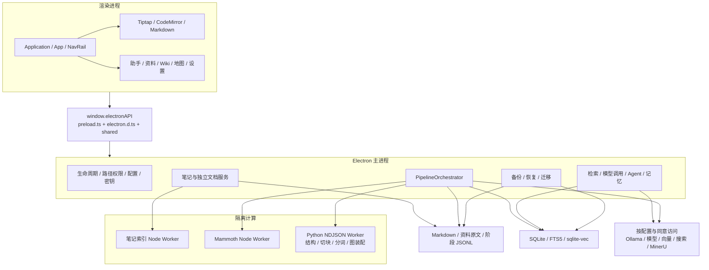
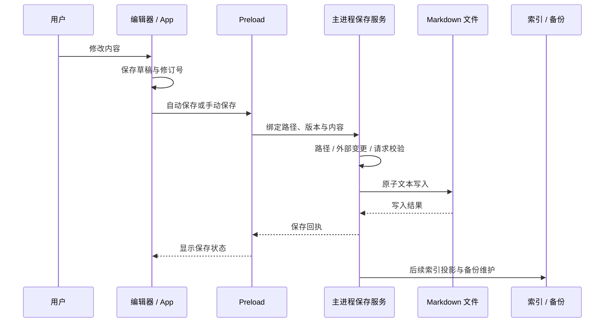
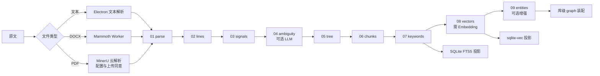
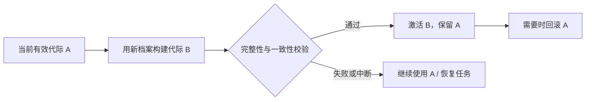
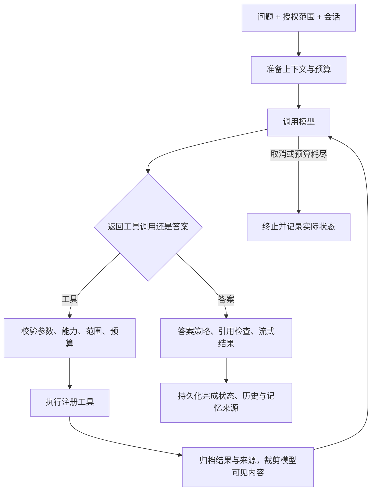
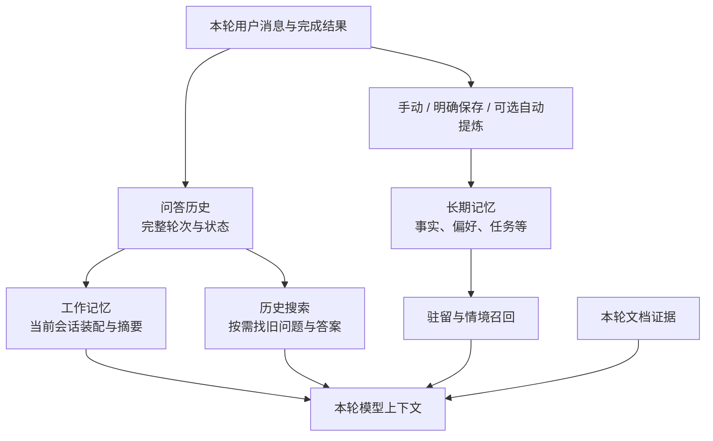
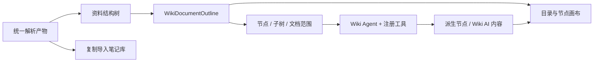
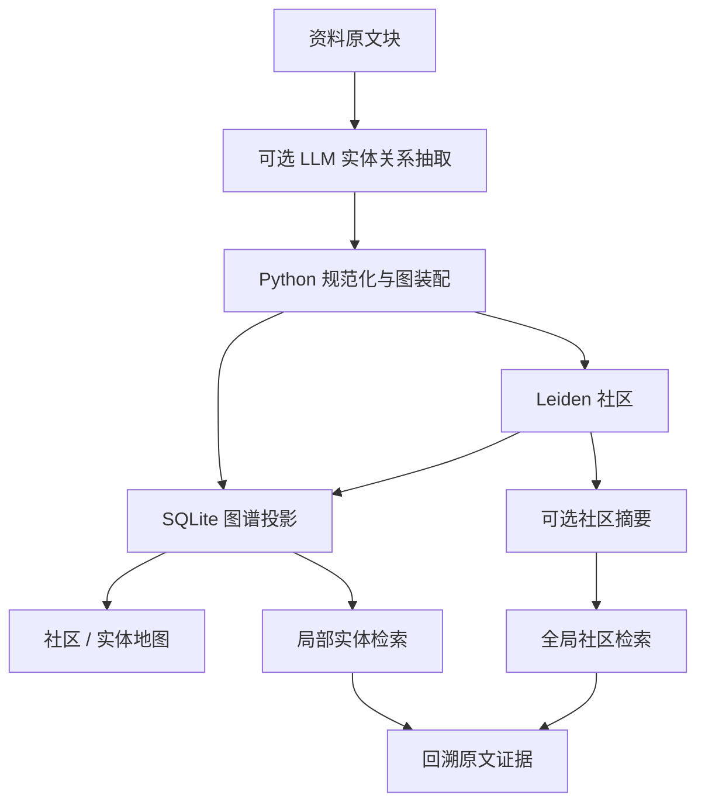

# Trellora 代码架构与内置能力

**简体中文** · [English](architecture.en.md) · [返回产品首页](../README.md)

本文面向希望理解、调试和扩展 Trellora 的开发者，依据 2026-10-05 当前工作树整理。源码入口均使用仓库相对链接，架构图使用 GitHub 支持的 Mermaid。设计文档描述的目标与实际实现有差异时，当前行为以源码为准；记忆域实施仍遵循 [领域主合同](Trellora-2.0-WeKnora记忆架构严格对齐改造方案.md)。

## 目录

- [整体架构与进程边界](#整体架构与进程边界)
- [目录与模块职责](#目录与模块职责)
- [界面与 IPC](#界面与-ipc)
- [笔记编辑与保存](#笔记编辑与保存)
- [独立文件工作区](#独立文件工作区)
- [资料库与文档流水线](#资料库与文档流水线)
- [关键词语义检索与向量代际](#关键词语义检索与向量代际)
- [模型网关与 AI Agent](#模型网关与-ai-agent)
- [历史工作记忆与长期记忆](#历史工作记忆与长期记忆)
- [Wiki 工作区](#wiki-工作区)
- [资料图谱与地图](#资料图谱与地图)
- [内置技能与联网能力](#内置技能与联网能力)
- [数据布局与恢复](#数据布局与恢复)
- [主题语言与首次引导](#主题语言与首次引导)
- [开发构建与验证](#开发构建与验证)
- [扩展与阅读入口](#扩展与阅读入口)

## 整体架构与进程边界

Trellora 是一个 **Windows 本地优先 Electron 桌面应用**。React 负责交互，Electron 主进程持有文件和数据库权限，计算任务分配给 Node Worker Thread 与 Python Sidecar。运行核心功能无需部署独立 Web 后端、Redis、PostgreSQL 或外部向量数据库。



| 运行单元 | 职责 | 边界 |
| --- | --- | --- |
| React 渲染进程 | 展示状态、编辑文档、收集用户操作、渲染图和对话 | 不直接读写任意本地文件，不启动 Python，不持有服务密钥 |
| Preload | 通过 `contextBridge` 暴露明确的方法和事件 | 不向页面提供通用 `fs`、`spawn` 或任意 IPC 调用能力 |
| Electron 主进程 | 路径、文件、数据库、模型配置、任务队列、会话与恢复 | 所有重要操作在此校验；界面禁用按钮不能代替权限检查 |
| Node Worker Thread | DOCX 解析、笔记索引等隔离计算 | 返回计算结果，由主进程协调数据提交 |
| Python Sidecar | 逻辑行、规则信号、结构、切块、关键词、实体后处理和库级图装配 | 只消费授权输入、写入分配的阶段目录，不写应用 SQLite，不修改用户原文 |
| 外部服务 | 用户配置的生成、Embedding、Rerank、搜索和 PDF 解析 | 是否联网、发送哪些内容，由具体能力与同意配置决定 |

主入口是 [electron/main.ts](../electron/main.ts)。窗口设置 `nodeIntegration: false`、`contextIsolation: true`；主进程集中注册 IPC 并校验来源。Worker 启动使用参数数组与 `shell: false`。这些进程边界有助于隔离权限和计算，但不等于运行任意不可信代码的安全沙箱。

## 目录与模块职责

| 目录 / 文件 | 主要职责 |
| --- | --- |
| [src/main.tsx](../src/main.tsx)、[Application.tsx](../src/Application.tsx) | React 入口、全局主题与应用环境 |
| [src/App.tsx](../src/App.tsx) | 工作区、导航、库切换、当前笔记与顶层界面协调 |
| [src/components/](../src/components/) | 笔记、助手、资料、Wiki、地图、设置与恢复界面 |
| [src/editor/](../src/editor/) | Tiptap 扩展、代码与公式节点、输入和粘贴策略、选区坐标 |
| [src/wiki/](../src/wiki/) | Wiki 状态、布局、任务控制与 Electron 数据源 |
| [src/i18n/](../src/i18n/) | 中文文案键、英文映射及订阅式语言切换 |
| [electron/main.ts](../electron/main.ts)、[preload.ts](../electron/preload.ts) | 生命周期、依赖装配、IPC 注册与受限桥接 |
| [electron/documents/](../electron/documents/) | 独立文件会话、编码、打开队列、资源、AI 与恢复草稿 |
| [electron/knowledge/](../electron/knowledge/) | 索引、检索、模型协议、Agent、上下文与记忆 |
| [electron/pipeline/](../electron/pipeline/) | 文档阶段编排、产物提交、向量和图谱投影 |
| [electron/wiki/](../electron/wiki/) | Wiki 原文范围、工具、派生节点、AI 内容与导入 |
| [electron/websearch/](../electron/websearch/) | 联网搜索服务商与网页获取 |
| [electron/backup/](../electron/backup/) | 一致性快照、归档、恢复与维护暂停 |
| [shared/](../shared/) | 跨进程类型、默认值、限额、配置与结果合同 |
| [pipeline-python/pipeline_worker/](../pipeline-python/pipeline_worker/) | NDJSON 协议与 Python 结构化阶段 |
| [build/builtin-skills/](../build/builtin-skills/) | 随桌面包发布的技能定义与模板 |
| [scripts/](../scripts/)、[docs/verification/](verification/) | 构建、聚焦验证、实际 Electron / 发布包证据 |

项目采用桌面内的模块划分。大量依赖装配和 IPC 仍集中于 `main.ts` 与 `App.tsx`；理解功能时，应继续进入被调用的领域模块，而不只阅读组件名称。

## 界面与 IPC

[NavRail.tsx](../src/components/NavRail.tsx) 定义助手、笔记、资料、Wiki、地图及底部打开、笔记库和设置。设置的十个子菜单由 [SettingsPanel.tsx](../src/components/SettingsPanel.tsx) 定义。产品菜单说明和截图见 [README](../README.md#菜单与截图)。

完整调用链是：**React 组件 → `window.electronAPI` → preload `ipcRenderer.invoke` → 主进程 handler → 领域服务 → 文件 / 数据库 / Worker → 结果或事件 → UI**。渲染声明见 [src/electron.d.ts](../src/electron.d.ts)，复杂共享合同位于 `shared/`。

| 领域 | 当前桥接方法示例 | 主进程执行内容 |
| --- | --- | --- |
| 笔记库 | `listLibraries`、`createLibrary`、`activateLibrary`、`removeLibrary` | 注册、真实路径和库可用性 |
| 资料库 | `createMaterialsLibrary`、`listMaterialsDocuments`、`importMaterialsDocuments` | 清单同步、文件导入与资料范围校验 |
| 流水线 | `startMaterialsPipeline`、`cancelMaterialsPipeline`、`getMaterialsPipelineStatus` | 排队、执行、取消和读取真实状态 |
| Wiki | `getWikiDocumentOutline`、`addWikiDerivedNode`、`reorderWikiSiblingNodes` | 原文结构、派生节点和顺序持久化 |
| 独立文件 | `openDocumentRequest`、`updateDocumentDraft`、`saveDocument`、`joinDocumentLibrary` | 绑定窗口和文件的会话、版本校验与写入 |
| 设置 | `getAppPreferences`、`saveAppPreferences` | 规范化并保存应用偏好 |
| 引导 | `getOnboardingState`、`saveOnboardingState`、`importOnboardingSample` | 引导进度、演示资料与首次练习 |
| 迁移 | `startWorkspaceMigration` 等 | 迁移预览、日志、恢复与切换 |

这些是当前实现的方法示例。工程约定里的 `pipeline:*` 是建议面；当前 preload 已使用 `start-materials-pipeline` 等通道，开发时应以实际桥接与类型声明为准。

## 笔记编辑与保存

### 编辑器与 Markdown

[Editor.tsx](../src/components/Editor.tsx) 集成 Tiptap / ProseMirror 与工具栏；源码编辑使用 CodeMirror，预览由 [MarkdownPreview.tsx](../src/components/MarkdownPreview.tsx) 及 Markdown 工具链渲染。入口包括 [markdown.ts](../src/utils/markdown.ts)、[preview.ts](../src/utils/preview.ts) 与 [MarkdownContent.tsx](../src/components/MarkdownContent.tsx)。

内置内容包括标题、列表、待办、表格、图片、链接、代码高亮、公式、Mermaid 与 Wiki 链接。代码、公式、Markdown 输入与粘贴都有专门的编辑扩展。DOMPurify 用于渲染清理。模式切换需要在 Markdown 与编辑器文档模型之间转换；复杂语法的保真验证见 Markdown 和编辑器脚本。

[EditorWordCount.tsx](../src/components/EditorWordCount.tsx) 提供可见字数；[EditorZoomControl.tsx](../src/components/EditorZoomControl.tsx) 管理缩放；[editorPreferences.ts](../shared/editorPreferences.ts) 统一字号、行距、段距、粘贴、选区工具栏和写作模式偏好。

### 文件写入与索引分离



主进程通过 [noteSaveService.ts](../electron/noteSaveService.ts)、[atomicTextWrite.ts](../electron/atomicTextWrite.ts)、[noteCloseCoordinator.ts](../electron/noteCloseCoordinator.ts) 协调保存、关闭与恢复。[noteBackups.ts](../electron/noteBackups.ts) 维护库内备份。[noteIndex.ts](../electron/noteIndex.ts) 与 [indexCoordinator.ts](../electron/knowledge/indexCoordinator.ts) 负责索引更新。

原文件写入成功与索引更新成功是不同结果，不能把索引失败解释为原文没有保存。库切换、异步保存、外部修改和关闭时应保持修订及草稿状态，避免迟到结果覆盖新的笔记。

### 选区 AI 编辑

[SelectionActionOverlay.tsx](../src/components/SelectionActionOverlay.tsx) 和选区编辑组件调用主进程的 [selectionEditCoordinator.ts](../electron/knowledge/selectionEditCoordinator.ts)、[selectionExpansionCoordinator.ts](../electron/knowledge/selectionExpansionCoordinator.ts)。主进程收集允许的原文、资料或网页证据，生成建议并验证写回范围。

选区变换以建议和可检查结果返回，写回还需检查文档和选区是否仍匹配。扩写有独立长度合同，见 [selectionExpansionPolicy.ts](../shared/selectionExpansionPolicy.ts)：默认目标约为原文有效字符的 `1.8×`，全笔记上下文阈值 `12,000` 字符，目标上限 `40,000` 字符。字符统计和目标不是对模型输出的无限保证，结果仍需通过质量与范围校验。

## 独立文件工作区

独立文件使用 [ExternalDocumentWorkspace.tsx](../src/components/ExternalDocumentWorkspace.tsx)，后端由 [DocumentSessionService](../electron/documents/documentSessionService.ts) 管理。它与注册笔记库的保存链分开，已登记库内文件会路由回笔记功能。

| 模块 | 内置能力 |
| --- | --- |
| [openRequestRouter.ts](../electron/documents/openRequestRouter.ts) | 统一处理选择器、启动参数和拖放的打开请求与队列 |
| [textCodec.ts](../electron/documents/textCodec.ts) | 文本编码、BOM、换行信息与解码 |
| [documentSessionService.ts](../electron/documents/documentSessionService.ts) | 会话绑定、磁盘版本、草稿、保存、另存为、刷新、关闭和加入库 |
| [externalRecoveryStore.ts](../electron/documents/externalRecoveryStore.ts) | 未保存草稿与恢复记录 |
| [documentResourceService.ts](../electron/documents/documentResourceService.ts) | 会话资源目录授权、本地图片、资源清单与复制 |
| [documentAiService.ts](../electron/documents/documentAiService.ts) | 文档 AI 生成、取消与修订校验后的应用 |

草稿自动进入恢复存储，原文件经手动保存写回。保存检查磁盘哈希、会话修订和路径；恢复草稿不应直接覆盖磁盘。加入笔记库复制当前内容及允许的引用资源。应用内部数据、备份、资料原件等受保护目录不能通过独立文件入口绕过专属流程编辑。

## 资料库与文档流水线

### 资料注册与原文

[materialsLibrary.ts](../electron/materialsLibrary.ts) 管理资料库注册、清单、文档 ID、文件类型与内容哈希；[MaterialsView.tsx](../src/components/MaterialsView.tsx) 展示列表和预览；[MaterialsPipelineView.tsx](../src/components/MaterialsPipelineView.tsx) 展示配置、状态与产物。

导入文件成为资料库原文。后续阶段只读原文，统一产物存到元数据目录；SQLite 保存可检索投影，不承载全部大型阶段文件。

### 阶段架构



图中是当前阶段顺序与主要产物关系；具体输入由阶段执行器决定，不代表每阶段只读取紧邻前一目录。禁用或缺少配置的可选能力会跳过或等待，不要求所有文档跑完全部阶段。

| 阶段 | 执行位置 | 主要内容 |
| --- | --- | --- |
| `parse` | Electron / Mammoth / MinerU | 统一 `document.md`、块、行布局与解析报告 |
| `lines` | Python | 从统一解析结果生成逻辑行 |
| `signals` | Python | 识别标题、列表、表格等规则信号 |
| `ambiguity` | Electron LLM 协调 | 按配置处理结构歧义；缺能力时按规则路线继续 |
| `tree` | Python | 构建章节及正文结构树 |
| `chunks` | Python，必要时 Electron 受控 LLM | Parent / Child 切块，结构、递归、固定长度、语义与 LLM 等策略 |
| `keywords` | Python → Electron | Jieba、关键词产物、FTS 检索投影 |
| `vectors` | Electron | 调用绑定 Embedding，提交块向量 |
| `entities` | Electron LLM + Python 后处理 | 可选实体关系抽取、整理和图谱输入 |
| 库级 `graph` | Python → Electron | 跨文档图装配、Leiden 社区与 SQLite 投影；不属于文档阶段枚举 |

[PipelineOrchestrator](../electron/pipeline/pipelineOrchestrator.ts) 管理队列、活动任务、取消、重试、启动续跑、维护暂停和图谱重建。解析分派入口是 [routes.ts](../electron/pipeline/routes.ts)，DOCX 模块为 [mammothStage.ts](../electron/pipeline/mammothStage.ts) 和 [mammothWorker.ts](../electron/pipeline/mammothWorker.ts)。

### Worker 协议与生命周期

[pythonWorkerClient.ts](../electron/pipeline/pythonWorkerClient.ts) 集中启动 Python。开发环境优先 `pipeline-python/.venv/Scripts/python.exe -m pipeline_worker`；打包环境使用 `resources/pipeline-runtime/python-worker.exe -E -m pipeline_worker`。启动 `hello` 校验协议版本、引擎版本与能力。

```json
{"id":"request-1","method":"hello","params":{"protocolVersion":1}}
{"id":"request-2","method":"runStage","params":{"jobId":"job-1","stage":"lines","inputPath":"...","outputDir":"...","options":{}}}
{"id":"request-3","method":"cancel","params":{"jobId":"job-1"}}
{"id":"request-4","method":"shutdown","params":{}}
```

标准输出只承载 NDJSON，日志进入标准错误；任务由请求 ID、job ID 与 stage 关联。Python [worker.py](../pipeline-python/pipeline_worker/worker.py) 分派独立阶段，也支持检索分词。Electron 的结果合同包含 `artifactManifest` 和计数。退出发送 `shutdown` 并有限等待；取消、输出限制、请求超时及失效恢复在客户端与编排器中处理。

当前通用 `runStage` 客户端超时为 **6 小时**，`tokenizeSearch` 为 **15 秒**，`cancel` 为 **10 秒**，`hello` 为 **15 秒**；不能把工程约定里“应设置任务超时”的要求描述成已经统一采用一个短时限。LLM 阶段还存在各自调用预算和超时。

### 产物、缓存与状态

当前实际布局由 [pathLayout.ts](../electron/pipeline/pathLayout.ts) 定义，比工程约定中的示例多一层流水线指纹：

```text
<资料库>/.menghan-meta/pipeline/
  <documentId>/<sourceContentHash>/<pipelineFingerprint>/
    00-source/source.json
    01-parse/
    02-lines/
    03-signals/
    04-ambiguity/
    05-tree/
    06-chunks/
    07-keywords/
    08-vectors/
    09-entities/
    checkpoints/
    pipeline-manifest.json
```

阶段键组合原文、配置、引擎 / 协议及上游输入版本。[artifactStore.ts](../electron/pipeline/artifactStore.ts) 负责临时产物校验和提交。缓存会区分有效产物与旧配置结果，原文或阶段配置变化使相关投影失效。

状态合同见 [types.ts](../electron/pipeline/types.ts)：`IDLE`、`QUEUED`、`RUNNING`、`SUCCEEDED`、`FAILED_RETRYABLE`、`FAILED`、`WAITING_CONFIG`、`SKIPPED`、`CANCELLED`、`INTERRUPTED`。UI 从主进程读取状态；FTS 状态单独从 SQLite 实际投影读回，不能只根据阶段文件宣告索引成功。

## 关键词语义检索与向量代际

### 不同检索入口

| 入口 | 实现与用途 |
| --- | --- |
| 笔记界面关键词搜索 | MiniSearch / 本地笔记索引；无需模型，适合标题、路径和文本定位 |
| 当前笔记章节读取与检索 | [currentNoteTools.ts](../electron/knowledge/currentNoteTools.ts)、[currentNoteLexicalIndex.ts](../electron/knowledge/currentNoteLexicalIndex.ts)；读取保存后的章节快照与局部内容 |
| 笔记知识索引 | [indexCoordinator.ts](../electron/knowledge/indexCoordinator.ts)、[metaDatabase.ts](../electron/knowledge/metaDatabase.ts)；块、AI 元数据和向量 |
| 资料库混合检索 | [materialChunkSearch.ts](../electron/pipeline/materialChunkSearch.ts)；FTS / 关键词与向量候选，按检索配置组合并可重排 |
| 图谱检索 | 局部实体关系和全局社区摘要检索，再回溯原文块 |
| 历史对话与长期记忆检索 | 各自独立的数据、范围与限额；不与资料证据合并成同一种来源 |

资料采用 **Child 命中、Parent 提供较完整上下文** 的结构，减少小块带来的语义断裂。关键词和向量索引缺失、过期或调用失败时，能力状态和可用检索路径需独立判断。实现不能保证每个问题都有有效候选，引用必须来自实际返回的证据。

### Embedding 一致性

[materialEmbeddingProfile.ts](../electron/pipeline/materialEmbeddingProfile.ts) 固定资料库模型档案；[materialEmbeddingAdapters.ts](../electron/pipeline/materialEmbeddingAdapters.ts) 发起调用；[materialVectorCoordinator.ts](../electron/pipeline/materialVectorCoordinator.ts) 协调向量任务。

同一向量空间不仅由维度决定，还包含模型、服务端、参数和文本处理相关身份。已有资料库的查询使用与索引匹配的档案，不应直接拿当前默认模型查询旧模型向量。



实现见 [materialVectorGenerationService.ts](../electron/pipeline/materialVectorGenerationService.ts)、[materialVectorGenerationStore.ts](../electron/pipeline/materialVectorGenerationStore.ts) 和 [shared/materialVectorGenerations.ts](../shared/materialVectorGenerations.ts)。索引代际管理的是资料库向量，不能推断所有其他存储都共享同一迁移机制。

## 模型网关与 AI Agent

### 模型接入层

[aiProvider.ts](../electron/knowledge/aiProvider.ts)、[modelHub.ts](../electron/knowledge/modelHub.ts) 与 [modelConfigurationService.ts](../electron/knowledge/modelConfigurationService.ts) 处理模型档案、选择、配置保存和变更影响。设置保留服务商、连接地址、协议与模型等独立字段。

| 协议 | 传输模块 |
| --- | --- |
| Ollama Chat | [ollamaClient.ts](../electron/knowledge/ollamaClient.ts) |
| OpenAI Chat Completions | [openAiCompletionsTransport.ts](../electron/knowledge/openAiCompletionsTransport.ts) |
| OpenAI Responses | [openAiResponsesTransport.ts](../electron/knowledge/openAiResponsesTransport.ts) |
| Anthropic Messages | [anthropicMessagesTransport.ts](../electron/knowledge/anthropicMessagesTransport.ts) |
| Google GenerateContent | [googleGenerateContentTransport.ts](../electron/knowledge/googleGenerateContentTransport.ts) |

[aiGenerationTransport.ts](../electron/knowledge/aiGenerationTransport.ts) 对接生成请求和流式事件。生成、Embedding、Rerank 分别配置；提供商支持列表不代表每个模型都具备工具调用、图片或思考输出能力。上下文窗口和输出预算由能力解析与 [modelCallCoordinator.ts](../electron/knowledge/modelCallCoordinator.ts) 协调。

### 三种问答路线

- **自由问答**：对问题、附件和适用的会话上下文回答；开启联网能力时可进入 [chatWebAgentTurn.ts](../electron/knowledge/chatWebAgentTurn.ts)。
- **当前笔记**：基于保存后的快照读取正文、章节和相邻内容；直接回答与工具路线均有实现，入口包括 [currentNoteAgentGraph.ts](../electron/knowledge/currentNoteAgentGraph.ts)。
- **个人知识库**：对选定资料库执行检索、读取原文、图谱或适用联网工具，入口包括 [knowledgeAgentTurn.ts](../electron/knowledge/knowledgeAgentTurn.ts) 与知识工具目录。

### 工具执行循环



[reactEngine.ts](../electron/knowledge/reactAgent/reactEngine.ts) 是受预算约束的 ReAct 循环，[toolRegistry.ts](../electron/knowledge/reactAgent/toolRegistry.ts) 提供工具注册和调用签名。执行记录包含轮次、模型和工具调用、停止原因与维护处理；相同动作的重复调用会受到约束。

项目包含多种执行方式，不能因为文件名带 `Graph` 就认定它使用 LangGraph：

| 执行入口 | 当前实现 | 内置任务 |
| --- | --- | --- |
| [agentGraph.ts](../electron/knowledge/agentGraph.ts) | 使用 LangGraph `Annotation` / `StateGraph`，supervisor 按任务分派 | 摘要、标签、笔记分析、回答、学习计划、整理建议 |
| [currentNoteAgentGraph.ts](../electron/knowledge/currentNoteAgentGraph.ts) | 自有计划、动作、证据与预算控制流程 | 当前笔记章节检索、按需读取、证据归纳与回答 |
| [libraryPlanAgentGraph.ts](../electron/knowledge/libraryPlanAgentGraph.ts) | 自有库快照、结构化动作与计划控制流程 | 笔记库范围的定位、章节读取和整理推理 |
| [reactAgent/reactEngine.ts](../electron/knowledge/reactAgent/reactEngine.ts) | 通用受限 ReAct 循环，路线注入工具与策略 | 资料问答、适用的联网及 Wiki 工具执行 |

ReAct 默认最多 **6 轮、8 次模型调用、10 次工具调用、1 次空回复重试**，连续相同输出的熔断轮数为 **2**；调用方可覆盖，维护摘要另有预算。来源见 [reactEngineTypes.ts](../electron/knowledge/reactAgent/reactEngineTypes.ts)。这些是执行约束，不是对答案正确性的保证。

内置知识工具包含 `knowledge_search`、`grep_chunks`、`list_knowledge_chunks`、`get_document_info`、`graph_local_search`、`graph_global_search`、`web_search`、网页获取、`read_skill`、`search_conversations` 和 `search_memory`。实际启用取决于 [toolCapabilityCatalog.ts](../electron/knowledge/toolCapabilityCatalog.ts)、当前范围、能力和用户配置。

[assistantCitationGuard.ts](../electron/knowledge/assistantCitationGuard.ts) 等模块约束引用；[assistantNote.ts](../electron/assistantNote.ts) 处理回答保存为笔记。模型给出工具名不会自动获得任意文件或其他资料库权限，实际读取由工具上下文和服务端范围决定。

## 历史工作记忆与长期记忆

### 四类能力分别负责什么



| 能力 | 数据与职责 | 关键源码 |
| --- | --- | --- |
| 问答历史 | 会话、消息、轮次、工具过程、完成 / 中断状态 | [qaMemoryDatabase.ts](../electron/knowledge/qaMemoryDatabase.ts)、[qaMemoryRepository.ts](../electron/knowledge/qaMemoryRepository.ts) |
| 工作记忆 | 在本轮模型窗口中装配最近历史、摘要和工具结果 | [qaMemoryOrchestrator.ts](../electron/knowledge/qaMemoryOrchestrator.ts)、[qaCanonicalHistory.ts](../electron/knowledge/qaCanonicalHistory.ts)、[reactAgent/toolResultBudget.ts](../electron/knowledge/reactAgent/toolResultBudget.ts) |
| 历史对话搜索 | 从过去会话找到相关问答，按范围和数量返回 | [knowledgeTools/searchConversationsTool.ts](../electron/knowledge/knowledgeTools/searchConversationsTool.ts) |
| 长期语义记忆 | 独立的资料、偏好、事实、任务和兴趣条目 | [memory/](../electron/knowledge/memory/)、[knowledgeTools/searchMemoryTool.ts](../electron/knowledge/knowledgeTools/searchMemoryTool.ts) |

工作区的统一数据库为 `ConversationMemory/qa-memory.db`，当前 schema 版本在源码中为 **11**。旧的库内会话和兼容仓库仍存在，不能因为出现新数据库就删除旧数据或宣布所有旧存储已消失。

### 长期记忆的保存与审查

长期记忆默认关闭，默认写入模式为 `explicit_only`。启用后提供手动管理、明确要求记住，以及用户选择 `auto` 后的自动提炼。条目类型为 `profile`、`preference`、`fact`、`task`、`interest`；来源为 `explicit`、`extracted`、`manual`；状态包括 `active`、`pending`、`superseded`、`archived`。

[MemoryExplicitSaveService](../electron/knowledge/memory/memoryExplicitSaveService.ts) 处理明确保存，[memoryExtractionScheduler.ts](../electron/knowledge/memory/memoryExtractionScheduler.ts) 与 [memoryExtractionService.ts](../electron/knowledge/memory/memoryExtractionService.ts) 处理异步提炼，[memoryConsolidationService.ts](../electron/knowledge/memory/memoryConsolidationService.ts) 处理整理。

当前实现保留变更提案和保护策略，见 [memoryWritePolicy.ts](../electron/knowledge/memory/memoryWritePolicy.ts)。需要审查的替换、停用或合并不会仅凭模型文本直接覆盖受保护记忆；[MemoryProposalReviewDialog.tsx](../src/components/settings/MemoryProposalReviewDialog.tsx) 展示待确认项。写入、待确认与失败由真实回执驱动，不能把模型说“我记住了”当作保存成功。

### 召回、来源与隔离

[memoryRecallService.ts](../electron/knowledge/memory/memoryRecallService.ts) 进行驻留和情境召回，[memoryConditioningService.ts](../electron/knowledge/memory/memoryConditioningService.ts) 提供受限检索调节，[memoryPrompt.ts](../electron/knowledge/memory/memoryPrompt.ts) 生成模型可见记忆块。记忆可以影响解释方式与偏好，不能替代本轮文档证据或改变工具授权范围。

[shared/memoryCitations.ts](../shared/memoryCitations.ts) 和助手记忆引用组件记录条目及原对话来源。原会话被删除、来源不可用或保存失败时应显示相应状态，不能伪造来源。范围合同区分自由问答、资料库、当前笔记、用户和工作区身份；共享数据库本身不等于隔离，必须检查仓储查询与工具上下文。

### 当前合同与运行开关

数值统一定义在 [memoryConstants.ts](../electron/knowledge/memory/memoryConstants.ts)，避免在路线适配器内另写默认值。

| 合同项 | 当前默认值 / 限额 |
| --- | --- |
| 长期记忆 | 默认关闭；`explicit_only`；默认最多 200 条 |
| 自动提炼时机 | 延迟 90 秒；最小间隔 300 秒 |
| 单条记忆 | 最多 300 个 Unicode code points；重要性 1–5 |
| 历史搜索 | 默认 5、最多 8 条；问题与答案预览各 400 code points |
| 情境召回 | 最多 5 条；情境块 600、驻留块 900 code points |
| 工作记忆摘要合同 | 占用超过 50% 时触发；目标 30%；原子裁剪触发超过 80% |
| 工具结果合同 | 窗口比例 20%，下限 8,192、上限 32,768 tokens |

这些是合同参数，实际预算还取决于模型窗口、路线和执行模式；合同中的默认 `200,000` tokens 不代表所有模型都拥有该窗口。

[assistantReleaseDefaults.ts](../shared/assistantReleaseDefaults.ts) 当前将长期记忆投影设为 `canonical`，四条路线继承；统一上下文运行模式和自适应上下文仍为 `observe`。因此 **canonical 记忆切流与上下文预算强制执行是不同状态**，不能声称所有线路都已统一启用 `enforce`。工程模式集中规范化，不作为普通用户随意配置的选项。

## Wiki 工作区

Wiki 从资料结构树构建章节空间。[wikiOutline.ts](../electron/wikiOutline.ts) 读取真实结构、原文块和行布局，[wikiLayout.ts](../src/wiki/wikiLayout.ts) 负责图布局，[WikiMapCanvas.tsx](../src/components/wiki/WikiMapCanvas.tsx) 使用 React Flow 展示节点。



| 能力 | 实现 |
| --- | --- |
| 文档目录、节点选择、折叠、缩放、顺序调整 | [WikiView.tsx](../src/components/wiki/WikiView.tsx)、[wikiViewState.ts](../src/wiki/wikiViewState.ts)、[wikiElectronDataSource.ts](../src/wiki/wikiElectronDataSource.ts) |
| 引导 / 自动模式、完整生成、节点分析、章节重试 | Wiki UI 与数据源协调任务和事件 |
| 节点范围和跨章节读取 | [wikiNodeScope.ts](../electron/wiki/wikiNodeScope.ts)、[wikiScopePolicy.ts](../electron/wiki/wikiScopePolicy.ts) |
| 问题改写、检索、原文充分性检查 | [wikiQueryRewrite.ts](../electron/wiki/wikiQueryRewrite.ts)、[wikiRetrievalCycle.ts](../electron/wiki/wikiRetrievalCycle.ts)、[wikiDirectEvidenceGate.ts](../electron/wiki/wikiDirectEvidenceGate.ts) |
| AI 分析 | [wikiNodeAgentTurn.ts](../electron/wiki/wikiNodeAgentTurn.ts) 与 [wikiTools/](../electron/wiki/wikiTools/) |
| 派生节点与 AI 内容 | [wikiDerivedNodes.ts](../electron/wiki/wikiDerivedNodes.ts)、[wikiAiMemories.ts](../electron/wiki/wikiAiMemories.ts) |
| 导入笔记库 | [wikiNoteImport.ts](../electron/wiki/wikiNoteImport.ts)；复制 Markdown 与受支持图片资源 |

源章节与派生节点分别标记。派生节点及 AI 内容在 `.menghan-meta/wiki/` 中持久化，源哈希用于防止旧文档结果冒充最新结果。Wiki AI 内容属于该文档学习产物，与工作区长期记忆是不同的数据合同。浏览真实结构不需要模型；生成和节点 AI 需要模型，原文和 AI 输出不会直接合并覆盖。

## 资料图谱与地图

图谱是可选的资料库增强。实体阶段得到实体及关系输入，Python 进行跨文档装配与 Leiden 社区划分，Electron 将结果投影到 SQLite，再供地图和检索使用。



核心实现为 [entities_stage.py](../pipeline-python/pipeline_worker/entities_stage.py)、[graph_stage.py](../pipeline-python/pipeline_worker/graph_stage.py)、[graph_leiden.py](../pipeline-python/pipeline_worker/graph_leiden.py)、[libraryGraphStore.ts](../electron/pipeline/libraryGraphStore.ts)、[graphProjection.ts](../electron/pipeline/graphProjection.ts)、[graphVectorIndex.ts](../electron/pipeline/graphVectorIndex.ts) 和 [communitySummaries.ts](../electron/pipeline/communitySummaries.ts)。

库级 `graphKey` 根据实体阶段键集合、Leiden 配置和图 schema 等输入计算；图产物保存在 `.menghan-meta/graph/<graphKey>/`。默认 Leiden 配置为 resolution `1.0`、maxDepth `4`、minSplitSize `3`、seed `42`。

地图 UI 是 [LibraryGraphView.tsx](../src/components/LibraryGraphView.tsx)。局部检索见 [graphLocalSearch.ts](../electron/pipeline/graphLocalSearch.ts)，全局检索见 [graphGlobalSearch.ts](../electron/pipeline/graphGlobalSearch.ts)。全局社区摘要用于形成整体理解，不能直接等同于原文引用；没有有效图谱投影时，工具会返回能力提示并引导改用普通资料检索。

仓库开发用 `graphify-out/` 与产品里的“地图”不是同一个功能。Graphify 是辅助阅读源码的分析产物，不参与用户资料处理或产品运行。

## 内置技能与联网能力

### 随应用发布的技能

[build/builtin-skills/](../build/builtin-skills/) 当前包含五个目录：

| 技能目录 | 用途 |
| --- | --- |
| [builtin-knowledge](../build/builtin-skills/builtin-knowledge/SKILL.md) | 基于知识来源进行问答 |
| [builtin-learning](../build/builtin-skills/builtin-learning/SKILL.md) | 学习与理解任务 |
| [builtin-organize](../build/builtin-skills/builtin-organize/SKILL.md) | 整理与归纳内容 |
| [generate-study-doc](../build/builtin-skills/generate-study-doc/SKILL.md) | 读取指定文档，使用模板生成学习文档 |
| [generate-experiment-report](../build/builtin-skills/generate-experiment-report/SKILL.md) | 依据已有实验记录与数据生成报告，显式标记缺口 |

[assistantSkills.ts](../electron/knowledge/assistantSkills.ts)、[skillDirectoryLoader.ts](../electron/knowledge/skillDirectoryLoader.ts)、[skillDefinitionResolver.ts](../electron/knowledge/skillDefinitionResolver.ts)、[skillImportService.ts](../electron/knowledge/skillImportService.ts) 负责技能加载、解析和导入；[readSkillTool.ts](../electron/knowledge/knowledgeTools/readSkillTool.ts) 供 Agent 按需读取定义与资源。

工作区 `AI-Skill/` 保存可管理的技能文件，[aiSkillWorkspace.ts](../electron/knowledge/aiSkillWorkspace.ts) 负责同步。技能为提示和模板提供结构，实际工具权限仍由注册表与范围校验决定，不能把技能定义解释成任意代码插件或通用本地 shell 执行授权。

### 搜索与网页

[webSearchProviders.ts](../electron/websearch/webSearchProviders.ts) 注册智谱、DuckDuckGo、SearXNG、Tavily 与百度适配器。每个适配器校验自己的配置字段与所需凭据。`web_search` 和网页获取作为工具进入适用 Agent 路线；未配置或不可用时会反馈原因。

网页链接打开方式支持应用内网页和系统浏览器。外部网页使用独立 preload，不共享主工作区的全部文件桥接。联网结果与用户资料是不同来源，展示和引用应保留该区别。

## 数据布局与恢复

### 本地数据模型

```text
<workspace>/
  .menghan-workspace/          工作区管理数据
  knowledge-base/             工作区内的个人资料库
  ConversationMemory/
    qa-memory.db              问答历史、长期记忆及相关元数据
  AI-Skill/                   用户可管理的技能文件

<note-library>/
  *.md / folders / assets     用户文件
  .menghan-meta/
    index.db                  库内知识索引与相关元数据
    wiki/                     该库的 Wiki 相关产物（适用时）
  .menghan-backups/            笔记备份

<materials-library>/
  documents/                  原始资料（新建资料库布局）
  .menghan-meta/
    pipeline/                 分阶段产物
    graph/                    库级图产物
    ...                       清单、索引与配置

<Electron userData>/
  config.json                 应用配置与注册关系；密钥字段为 safeStorage 密文
  external-documents/         独立文件恢复草稿与私有资源
  logs/                       运行日志与诊断
```

这是职责布局，具体数据库和兼容文件以创建模块为准。外部已注册库可以位于工作区之外；工作区备份不等于自动复制所有任意磁盘文件。历史 `.menghan-*` 名称保留用于兼容。

### 备份与恢复

库内笔记备份由 `noteBackups.ts` 负责；完整工作区备份由 [workspaceBackupService.ts](../electron/backup/workspaceBackupService.ts) 和 [snapshot.ts](../electron/backup/snapshot.ts) 负责。归档见 [archive.ts](../electron/backup/archive.ts)，恢复见 [workspaceRestoreService.ts](../electron/backup/workspaceRestoreService.ts) 与 [physicalRestore.ts](../electron/backup/physicalRestore.ts)。

完整备份包括范围映射、文件哈希、一致性快照和关联库处理。维护暂停由 [maintenance.ts](../electron/backup/maintenance.ts) 与 [restorePause.ts](../electron/backup/restorePause.ts) 协调，避免恢复与普通写入相互竞争。服务密钥不作为可移植明文导出。

### 存储迁移

[workspaceMigrationService.ts](../electron/workspaceMigrationService.ts) 与 [workspaceMigrationWorker.ts](../electron/workspaceMigrationWorker.ts) 执行工作区内迁移；[WorkspaceMigrationDialog.tsx](../src/components/WorkspaceMigrationDialog.tsx) 展示阻止其他操作的进度与恢复选项。

迁移先预览范围，复制和映射，完成校验后发布新位置并刷新界面。原目录保留，外部库继续关联原位置；取消或中断依靠迁移日志继续或使用原位置。锁与根目录归属见 [dataRootLocks.ts](../electron/dataRootLocks.ts)。迁移不能只改配置路径而遗漏草稿、会话、附件、技能或外部库关系。

## 主题语言与首次引导

- **主题**：[shared/lightColorSchemes.ts](../shared/lightColorSchemes.ts) 定义五种配色，[theme.ts](../src/utils/theme.ts) 与 `Application.tsx` 应用系统 / 浅色 / 深色、密度和持久偏好。启动外观与运行界面共用配置。
- **语言**：[src/i18n/index.ts](../src/i18n/index.ts) 的 `t()` 与 `useI18n()` 订阅偏好变化，中文文本为键，英文来自映射。未知文案回退原文，不翻译用户笔记，不因为语言切换重新创建编辑器。
- **首次引导**：[OnboardingGuide.tsx](../src/components/onboarding/OnboardingGuide.tsx) 与 [electron/onboarding/](../electron/onboarding/) 实现菜单介绍 → 配置 AI → 第一次提问。状态包括 `pending`、`skipped`、`completed`；已有模型可直接练习，连接测试与真实回答分别判断。
- **诊断**：设置与 [CapabilityPanel.tsx](../src/components/CapabilityPanel.tsx) 展示能力状态，主进程记录日志和异常。配置存在、连接可用、真实调用完成与发行包验收是不同结论。

## 开发构建与验证

### 启动与运行时

实际脚本见 [package.json](../package.json)。`pnpm dev` 并行运行 Vite 和 Electron，`build:electron` 使用 esbuild 生成主进程、preload、索引、Mammoth、迁移和 PDF Worker 入口。

```powershell
pnpm install
pnpm run rebuild:native
pnpm dev
```

`better-sqlite3` 与 Electron ABI 必须一致，普通 Node.js 能加载原生模块不能证明 Electron 能加载。SQLite 验证脚本应按仓库提供的 Electron Node 启动器执行。开发 Python 使用 `.venv`，发布依赖使用 `.deps`，两者承担不同用途。

### 打包链

```powershell
python -m pip install -r pipeline-python\requirements.txt --target pipeline-python\.deps
pnpm build
pnpm run release:manifest
```

[build-pipeline-runtime.mjs](../scripts/build-pipeline-runtime.mjs) 组装 CPython、Python 标准库、Worker、Jieba 及图谱依赖，校验握手并生成 runtime manifest；需要可用 CPython 安装而非仅靠项目 `.venv`。脚本优先 `py -3`，可用 `MENGHAN_PIPELINE_PYTHON` 指定解释器。

electron-builder 的 `extraResources` 携带 `pipeline-runtime` 和 `builtin-skills`，原生 SQLite / sqlite-vec 与适用 Node Worker 放到 `asarUnpack`。[build-windows-packages.mjs](../scripts/build-windows-packages.mjs) 生成 portable 和 NSIS；[installer.nsh](../build/installer.nsh) 处理可选 Windows 文件打开方式。`portable.unpackDirName: true` 对应每次运行的独立解压目录。签名状态以实际清单为准。

### 验证层次

| 层次 | 命令 / 证据 | 能证明的内容 |
| --- | --- | --- |
| 静态检查 | `pnpm exec tsc -b`、`pnpm lint` | 类型、代码规则和基本调用合同 |
| 聚焦模块验证 | `verify:markdown`、`verify:ai-provider`、`verify:wiki-workspace` 等 | 固定夹具下的功能与边界 |
| Python 测试 | `.venv/Scripts/python.exe -m unittest discover -s pipeline-python/tests -v` | 结构、切块、关键词、图阶段算法与协议 |
| 实际 Electron | `verify:*electron` 系列及 `docs/verification/` | 主进程 / preload / UI、事件时序与文件交互 |
| 真实服务 | 相关脚本 `--real` 或专属真实模型脚本 | 指定配置和范围下的实际模型 / 云服务行为 |
| 发行包和干净 Windows | 分发及文件打开方式验收记录 | runtime 携带、原生依赖、安装 / 启动 / 移机与关联 |

本次自行拍摄的演示截图完成了当前源码的隔离 Electron 构建、本地 Markdown 流水线和八个菜单的界面拍摄，没有执行远程模型、MinerU、图谱增强或干净机器发行验收。README 另外收录了用户提供的实际使用截图，两组图片的来源分别记录在 [展示资源说明](assets/README.md)。不能把截图来源说明解释成全部功能的端到端保证。

## 扩展与阅读入口

| 想扩展的功能 | 建议阅读与修改的位置 | 必须保持的合同 |
| --- | --- | --- |
| 新 UI / IPC | 组件 → preload → `electron.d.ts` / `shared` → 主进程 | 明确方法、来源校验与真实状态 |
| 新模型服务 | Provider 配置、model hub、transport 和能力解析 | 不把密钥传到渲染层；独立处理协议和模型能力 |
| 新搜索服务商 | `electron/websearch` 注册表与适配器 | 配置校验、凭据存储、结果来源 |
| 新文档阶段 | Orchestrator、阶段类型、缓存键、Worker 分派与产物校验 | 不写用户原文、不由 Python 写应用 SQLite |
| 新 Agent 工具 | 工具注册、能力目录、具体上下文 | 参数、范围、预算、取消和证据来源 |
| 新技能 | `SKILL.md`、模板资源、加载器与启用范围 | 技能说明不扩大实际工具授权 |
| 记忆改造 | 主合同与 `memoryConstants.ts`、仓储和路线适配 | 一次一个 WK-M 阶段，保留范围、审查与失败回执 |
| 保存 / 迁移 / 恢复 | 文档保存、备份与迁移服务 | 保留草稿、外部库、附件与已有用户内容 |

推荐阅读顺序：先看 `NavRail.tsx` 与 `App.tsx` 理解入口，再追 `preload.ts` 和 `main.ts` 中的对应 handler，最后进入领域模块和验证脚本。不要从旧设计方案推断当前功能已经完成。

工程规则见 [AGENTS.md](../AGENTS.md)，用户数据操作见 [桌面分发与备份恢复使用说明](桌面分发与备份恢复使用说明.md)，产品与截图见 [README](../README.md)。
