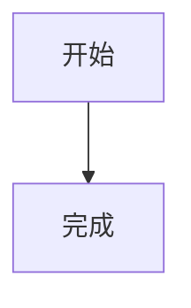

# Markdown 渲染全功能基线

这是一段包含 **粗体**、*斜体*、~~删除线~~、`inline code` 和 <https://example.com/docs> 的中文正文。

This English paragraph keeps a [fragment link](#english-heading) alongside 中文内容。

[跳转到第二个重复标题](#重复标题-2) · [相关笔记](../related.md#english-heading) · [外部文档](https://example.com/guide)

## 重复标题

第一个同名标题用于记录当前标题锚点行为。

## 重复标题

第二个同名标题用于后续验证稳定去重锚点。

## English Heading

- 无序列表
  - 嵌套列表

### 任务列表

- [ ] 待完成任务
- [x] 已完成任务

1. 第一项
2. 第二项

> 普通引用块

> [!warning]
> Callout 同时包含 **强调内容** 和中文说明。

| 功能 | 状态 | 对齐 |
| :--- | :---: | ---: |
| GFM 表格 | 已实现 | 100% |
| 中英文 | Mixed | 80% |

行内公式 $E = mc^2$。

$$
\int_0^1 x^2\,dx = \frac{1}{3}
$$

```ts
const greeting: string = '你好，Trellora';
console.log(greeting);
```

```
# 文档唯一标识
documentId = 501
```



脚注引用位于这里[^baseline]。

[^baseline]: 这是渲染回归夹具中的脚注正文。

[[产品设计|Trellora 产品设计]]


<mark>允许保留的安全 HTML</mark>
